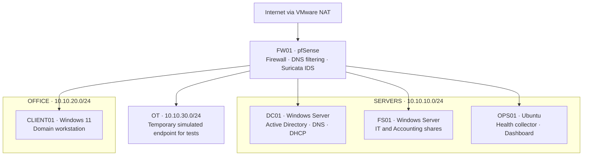
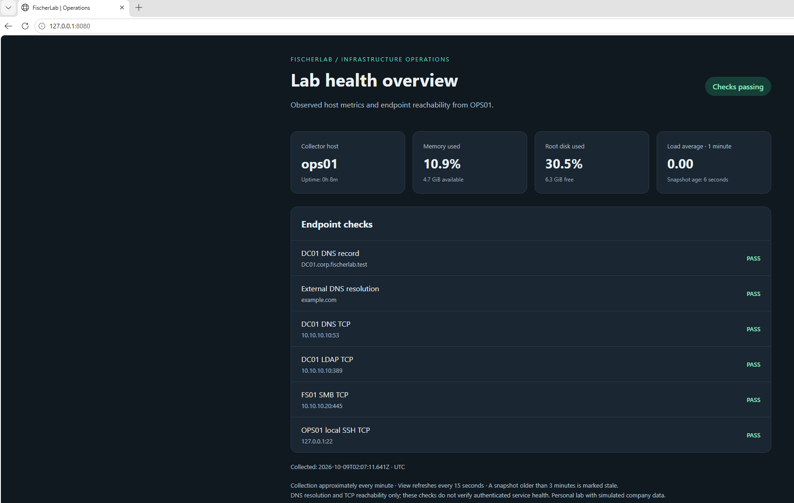

# Enterprise Infrastructure & IT Operations Lab

**Kyle Fischer · Infrastructure, systems administration & IT operations**

A five-VM personal lab that follows an employee's access from provisioning to offboarding, while testing the network, file services, monitoring, and recovery that support daily work. Built in VMware with simulated company data.

## What this project demonstrates

- **Identity and automation:** organize Active Directory and provision 26 simulated employees with repeatable PowerShell workflows.
- **Employee productivity:** join a Windows workstation to the domain, apply Group Policy, and map department drives.
- **Access control:** enforce department file permissions, route traffic through scoped firewall rules, and test denied paths.
- **Operations and recovery:** run a Linux health dashboard, restore a deleted file with integrity checks, and verify services after reboot.
- **Security visibility and lifecycle:** apply DNS filtering, generate an intrusion-detection alert, and verify a disabled account cannot reconnect.

## Architecture

Five VMs share one physical host. SERVERS, OFFICE, and OT are separate routed virtual subnets. The dashboard is bound to loopback and viewed through an SSH tunnel.

| System | Responsibility | Platform |
|---|---|---|
| FW01 | Network controls, DNS filtering, intrusion detection | pfSense CE 2.9.0 |
| DC01 | Domain identity, DNS, and employee-network DHCP | Windows Server 2022 |
| FS01 | Department shares and file recovery | Windows Server 2022 |
| OPS01 | Resource metrics and endpoint monitoring | Ubuntu 26.04.1 |
| CLIENT01 | Employee sign-in, policies, drives, and access tests | Windows 11 |

## Results at a glance

The post-reboot dashboard shows six passing DNS/TCP checks. Separate employee tests demonstrate authenticated file access, department separation, and disabled-account rejection.

## Top 10 evidence screenshots

These are the strongest entry points into the recorded results. Each links directly to the original screenshot.

| # | Screenshot | What it demonstrates |
|---|---|---|
| 1 | [Operations dashboard after reboot](evidence/016-post-reboot-validation/004-fresh-post-reboot-health-dashboard.png) | Fresh metrics and six passing DNS/TCP endpoint checks after restart. |
| 2 | [Firewall and network overview](evidence/016-post-reboot-validation/005-fw-post-reboot-resources-dnsbl.png) | Four active interfaces, retained DNS filtering, and modest resource use. |
| 3 | [Active Directory organization](evidence/002-active-directory/009-directory-ou-tree.png) | Department OUs, groups, servers, users, and workstations organized in the domain. |
| 4 | [Employee provisioning verification](evidence/003-employee-provisioning/008-final-employee-verification.png) | 26 simulated employees checked for identity, OU placement, department, and group membership. |
| 5 | [Employee policy and mapped-drive access](evidence/011-firewall-hardening/049-restored-office-employee-policy-drive-pass.png) | Successful policy refresh, department drive policy, and file read after network testing. |
| 6 | [Department permission boundaries](evidence/008-department-drive-mapping/011-accounting-write-read-it-denied.png) | Accounting pilot writes and reads its own share while IT access is denied. |
| 7 | [File recovery with integrity verification](evidence/010-file-backup-and-restore/006-controlled-deletion-restore-hash-acl.png) | Deleted test file restored with matching SHA-256 and preserved permissions. |
| 8 | [Controlled network segmentation test](evidence/011-firewall-hardening/045-verified-ot-listener-repeat-block-log.png) | Firewall records denied traffic to a temporary OT endpoint after its listener was verified. |
| 9 | [Intrusion detection after reboot](evidence/016-post-reboot-validation/008-post-reboot-signature-alert.png) | A new benign test packet triggers Suricata SID 2100498 after restart. |
| 10 | [Offboarding without disrupting another employee](evidence/015-employee-offboarding/007-amelia-read-disabled-smb-auth-rejected.png) | Amelia can read the test file; the disabled test account receives SMB error 1331. |

For the segmentation screenshot, [the local listener baseline](evidence/011-firewall-hardening/044-ot-listener-local-positive-baseline.png) and [the repeated remote test](evidence/011-firewall-hardening/046-ops-repeat-dc-pass-verified-ot-timeout.png) provide the supporting context.

## Explore the implementation

- [Architecture and address plan](docs/architecture.md)
- [Validation results and limitations](docs/validation-summary.md)
- [Build history](docs/build-log.md)
- [Monitoring runbook](docs/operations-monitoring.md) · [File recovery runbook](docs/file-recovery.md)
- [PowerShell and Linux scripts](scripts/README.md) · [Synthetic employee roster](data/simulated-employees.csv)
- [Publication review](docs/release-review.md) · [Screenshot showcase guide](docs/screenshot-showcase.md)

## Detailed evidence

Expand a milestone to see its ticket, evidence notes, and original screenshots. Historical captures include failed attempts and the later validation or recovery.

LAB-001 – Build the routed network foundation · 15 screenshots

[Implementation ticket](tickets/001-network-foundation.md) · [Evidence notes](evidence/001-network-foundation/README.md)

- [001 network editor](evidence/001-network-foundation/001-network-editor.png)
- [002 fw01 adapter 1](evidence/001-network-foundation/002-fw01-adapter-1.png)
- [002 fw01 adapter 2](evidence/001-network-foundation/002-fw01-adapter-2.png)
- [002 fw01 adapter 3](evidence/001-network-foundation/002-fw01-adapter-3.png)
- [002 fw01 adapter 4](evidence/001-network-foundation/002-fw01-adapter-4.png)
- [004 fw01 interface addresses](evidence/001-network-foundation/004-fw01-interface-addresses.png)
- [005 connectivity validation](evidence/001-network-foundation/005-connectivity-validation.png)
- [006 dc01 ipv4 settings](evidence/001-network-foundation/006-dc01-ipv4-settings.png)
- [007 fw01 dashboard from dc01](evidence/001-network-foundation/007-fw01-dashboard-from-dc01.png)
- [008 fw01 wan settings](evidence/001-network-foundation/008-fw01-wan-settings.png)
- [009 servers dhcp disabled](evidence/001-network-foundation/009-servers-dhcp-disabled.png)
- [010 wan filtering](evidence/001-network-foundation/010-wan-filtering.png)
- [011 servers interface](evidence/001-network-foundation/011-servers-interface.png)
- [012 office interface](evidence/001-network-foundation/012-office-interface.png)
- [013 ot interface](evidence/001-network-foundation/013-ot-interface.png)

LAB-002 – Deploy Active Directory and domain DNS · 9 screenshots

[Implementation ticket](tickets/002-active-directory.md) · [Evidence notes](evidence/002-active-directory/README.md)

- [001 dc01 preflight](evidence/002-active-directory/001-dc01-preflight.png)
- [002 ad ds role installed](evidence/002-active-directory/002-ad-ds-role-installed.png)
- [003 dc01 domain after restart](evidence/002-active-directory/003-dc01-domain-after-restart.png)
- [004 dns forwarder](evidence/002-active-directory/004-dns-forwarder.png)
- [005 ad services and dns tests](evidence/002-active-directory/005-ad-services-and-dns-tests.png)
- [006 dcdiag dns passed](evidence/002-active-directory/006-dcdiag-dns-passed.png)
- [007 directory structure preview](evidence/002-active-directory/007-directory-structure-preview.png)
- [008 directory create and rerun](evidence/002-active-directory/008-directory-create-and-rerun.png)
- [009 directory ou tree](evidence/002-active-directory/009-directory-ou-tree.png)

LAB-003 – Provision simulated employees by department · 8 screenshots

[Implementation ticket](tickets/003-employee-provisioning.md) · [Evidence notes](evidence/003-employee-provisioning/README.md)

- [001 pilot ou and membership](evidence/003-employee-provisioning/001-pilot-ou-and-membership.png)
- [002 pilot membership detail](evidence/003-employee-provisioning/002-pilot-membership-detail.png)
- [003 pilot account settings](evidence/003-employee-provisioning/003-pilot-account-settings.png)
- [004 pre import account inventory](evidence/003-employee-provisioning/004-pre-import-account-inventory.png)
- [005 domain import preview](evidence/003-employee-provisioning/005-domain-import-preview.png)
- [006 employee import applied](evidence/003-employee-provisioning/006-employee-import-applied.png)
- [007 no change import rerun](evidence/003-employee-provisioning/007-no-change-import-rerun.png)
- [008 final employee verification](evidence/003-employee-provisioning/008-final-employee-verification.png)

LAB-004 – Join CLIENT01 and validate employee sign-in · 7 screenshots

[Implementation ticket](tickets/004-client-domain-join.md) · [Evidence notes](evidence/004-client-domain-join/README.md)

- [001 office bootstrap rule](evidence/004-client-domain-join/001-office-bootstrap-rule.png)
- [002 client ipv4 link disconnected](evidence/004-client-domain-join/002-client-ipv4-link-disconnected.png)
- [003 client connectivity failed](evidence/004-client-domain-join/003-client-connectivity-failed.png)
- [004 client connectivity restored](evidence/004-client-domain-join/004-client-connectivity-restored.png)
- [005 pilot domain session](evidence/004-client-domain-join/005-pilot-domain-session.png)
- [006 domain membership secure channel](evidence/004-client-domain-join/006-domain-membership-secure-channel.png)
- [007 client workstations ou](evidence/004-client-domain-join/007-client-workstations-ou.png)

LAB-005 – Windows DHCP for the OFFICE subnet · 6 screenshots

[Implementation ticket](tickets/005-office-dhcp.md) · [Evidence notes](evidence/005-office-dhcp/README.md)

- [001 dhcp role installed](evidence/005-office-dhcp/001-dhcp-role-installed.png)
- [002 office address pool](evidence/005-office-dhcp/002-office-address-pool.png)
- [003 office option list](evidence/005-office-dhcp/003-office-option-list.png)
- [004 office option values](evidence/005-office-dhcp/004-office-option-values.png)
- [005 dhcp service authorization active scope](evidence/005-office-dhcp/005-dhcp-service-authorization-active-scope.png)
- [006 client01 dhcp lease](evidence/005-office-dhcp/006-client01-dhcp-lease.png)

LAB-006 – Apply a workstation Group Policy baseline · 3 screenshots

[Implementation ticket](tickets/006-workstation-group-policy.md) · [Evidence notes](evidence/006-workstation-group-policy/README.md)

- [001 configured policy settings](evidence/006-workstation-group-policy/001-configured-policy-settings.png)
- [002 client policy update and result](evidence/006-workstation-group-policy/002-client-policy-update-and-result.png)
- [003 client01 logon notice](evidence/006-workstation-group-policy/003-client01-logon-notice.png)

LAB-007 – Department file services on FS01 · 25 screenshots

[Implementation ticket](tickets/007-department-file-services.md) · [Evidence notes](evidence/007-department-file-services/README.md)

- [001 fs01 preflight](evidence/007-department-file-services/001-fs01-preflight.png)
- [002 fs01 domain welcome](evidence/007-department-file-services/002-fs01-domain-welcome.png)
- [003 fs01 domain membership](evidence/007-department-file-services/003-fs01-domain-membership.png)
- [004 fs01 servers ou](evidence/007-department-file-services/004-fs01-servers-ou.png)
- [005 accounting access group type](evidence/007-department-file-services/005-accounting-access-group-type.png)
- [006 accounting group nesting](evidence/007-department-file-services/006-accounting-group-nesting.png)
- [007 it access group type](evidence/007-department-file-services/007-it-access-group-type.png)
- [008 it group nesting](evidence/007-department-file-services/008-it-group-nesting.png)
- [009 fs01 network role precheck](evidence/007-department-file-services/009-fs01-network-role-precheck.png)
- [010 accounting ntfs permissions](evidence/007-department-file-services/010-accounting-ntfs-permissions.png)
- [011 it ntfs permissions](evidence/007-department-file-services/011-it-ntfs-permissions.png)
- [012 accounting share department](evidence/007-department-file-services/012-accounting-share-department.png)
- [013 accounting share admin account](evidence/007-department-file-services/013-accounting-share-admin-account.png)
- [014 it share department](evidence/007-department-file-services/014-it-share-department.png)
- [015 it share admin account](evidence/007-department-file-services/015-it-share-admin-account.png)
- [016 administrators picker domain location](evidence/007-department-file-services/016-administrators-picker-domain-location.png)
- [017 it share administrators corrected](evidence/007-department-file-services/017-it-share-administrators-corrected.png)
- [018 accounting share administrators corrected](evidence/007-department-file-services/018-accounting-share-administrators-corrected.png)
- [019 office smb rule applied](evidence/007-department-file-services/019-office-smb-rule-applied.png)
- [020 pilot smb connectivity](evidence/007-department-file-services/020-pilot-smb-connectivity.png)
- [021 it share test file](evidence/007-department-file-services/021-it-share-test-file.png)
- [022 accounting access error pending](evidence/007-department-file-services/022-accounting-access-error-pending.png)
- [023 accounting permission denied](evidence/007-department-file-services/023-accounting-permission-denied.png)
- [024 it file create and read](evidence/007-department-file-services/024-it-file-create-and-read.png)
- [025 it existing file modification](evidence/007-department-file-services/025-it-existing-file-modification.png)

LAB-008 – Map department drives with Group Policy · 12 screenshots

[Implementation ticket](tickets/008-department-drive-mapping.md) · [Evidence notes](evidence/008-department-drive-mapping/README.md)

- [001 it user group targeting](evidence/008-department-drive-mapping/001-it-user-group-targeting.png)
- [002 it drive configuration](evidence/008-department-drive-mapping/002-it-drive-configuration.png)
- [003 it mapped drive readback](evidence/008-department-drive-mapping/003-it-mapped-drive-readback.png)
- [004 department mapping list](evidence/008-department-drive-mapping/004-department-mapping-list.png)
- [005 accounting first password change](evidence/008-department-drive-mapping/005-accounting-first-password-change.png)
- [006 accounting session logon notice](evidence/008-department-drive-mapping/006-accounting-session-logon-notice.png)
- [007 accounting drive configuration](evidence/008-department-drive-mapping/007-accounting-drive-configuration.png)
- [008 accounting user group targeting](evidence/008-department-drive-mapping/008-accounting-user-group-targeting.png)
- [009 accounting user policy result](evidence/008-department-drive-mapping/009-accounting-user-policy-result.png)
- [010 accounting drive connected](evidence/008-department-drive-mapping/010-accounting-drive-connected.png)
- [011 accounting write read it denied](evidence/008-department-drive-mapping/011-accounting-write-read-it-denied.png)
- [012 accounting reconnect corrected](evidence/008-department-drive-mapping/012-accounting-reconnect-corrected.png)

LAB-009 – Prepare Ubuntu operations server · 23 screenshots

[Implementation ticket](tickets/009-ubuntu-operations-server.md) · [Evidence notes](evidence/009-ubuntu-operations-server/README.md)

- [001 ubuntu console login](evidence/009-ubuntu-operations-server/001-ubuntu-console-login.png)
- [002 host and network preflight](evidence/009-ubuntu-operations-server/002-host-and-network-preflight.png)
- [003 existing netplan and networkd](evidence/009-ubuntu-operations-server/003-existing-netplan-and-networkd.png)
- [004 static network and dns validation](evidence/009-ubuntu-operations-server/004-static-network-and-dns-validation.png)
- [005 storage ssh package preflight](evidence/009-ubuntu-operations-server/005-storage-ssh-package-preflight.png)
- [006 ssh listener and phased updates](evidence/009-ubuntu-operations-server/006-ssh-listener-and-phased-updates.png)
- [007 client01 ssh tcp connectivity](evidence/009-ubuntu-operations-server/007-client01-ssh-tcp-connectivity.png)
- [008 client01 authenticated ssh session](evidence/009-ubuntu-operations-server/008-client01-authenticated-ssh-session.png)
- [009 reboot persistence storage firewall](evidence/009-ubuntu-operations-server/009-reboot-persistence-storage-firewall.png)
- [010 ufw active and fresh ssh login](evidence/009-ubuntu-operations-server/010-ufw-active-and-fresh-ssh-login.png)
- [011 client01 dhcp reservation](evidence/009-ubuntu-operations-server/011-client01-dhcp-reservation.png)
- [012 office restricted ssh rule](evidence/009-ubuntu-operations-server/012-office-restricted-ssh-rule.png)
- [013 runtime time service preflight](evidence/009-ubuntu-operations-server/013-runtime-time-service-preflight.png)
- [014 first health snapshot](evidence/009-ubuntu-operations-server/014-first-health-snapshot.png)
- [015 health snapshot scope](evidence/009-ubuntu-operations-server/015-health-snapshot-scope.png)
- [016 recurring health timer](evidence/009-ubuntu-operations-server/016-recurring-health-timer.png)
- [017 live health dashboard](evidence/009-ubuntu-operations-server/017-live-health-dashboard.png)
- [018 dashboard service and ssh tunnel](evidence/009-ubuntu-operations-server/018-dashboard-service-and-ssh-tunnel.png)
- [019 dashboard stale snapshot](evidence/009-ubuntu-operations-server/019-dashboard-stale-snapshot.png)
- [020 collector pause and resume](evidence/009-ubuntu-operations-server/020-collector-pause-and-resume.png)
- [021 dashboard recovered snapshot](evidence/009-ubuntu-operations-server/021-dashboard-recovered-snapshot.png)
- [022 monitoring firewall after reboot](evidence/009-ubuntu-operations-server/022-monitoring-firewall-after-reboot.png)
- [023 dashboard after reboot](evidence/009-ubuntu-operations-server/023-dashboard-after-reboot.png)

LAB-010 – File backup and restore exercise · 8 screenshots

[Implementation ticket](tickets/010-file-backup-and-restore.md) · [Evidence notes](evidence/010-file-backup-and-restore/README.md)

- [001 fs01 role and storage preflight](evidence/010-file-backup-and-restore/001-fs01-role-and-storage-preflight.png)
- [002 new backup disk uninitialized](evidence/010-file-backup-and-restore/002-new-backup-disk-uninitialized.png)
- [003 labbackups volume ready](evidence/010-file-backup-and-restore/003-labbackups-volume-ready.png)
- [004 test hash and successful backup](evidence/010-file-backup-and-restore/004-test-hash-and-successful-backup.png)
- [005 backup catalog original acl hash](evidence/010-file-backup-and-restore/005-backup-catalog-original-acl-hash.png)
- [006 controlled deletion restore hash acl](evidence/010-file-backup-and-restore/006-controlled-deletion-restore-hash-acl.png)
- [007 accounting denied restored file](evidence/010-file-backup-and-restore/007-accounting-denied-restored-file.png)
- [008 it read restored file](evidence/010-file-backup-and-restore/008-it-read-restored-file.png)

LAB-011 – Replace bootstrap firewall access and validate segmentation · 50 screenshots

[Implementation ticket](tickets/011-firewall-hardening.md) · [Evidence notes](evidence/011-firewall-hardening/README.md)

- [001 wan rules baseline](evidence/011-firewall-hardening/001-wan-rules-baseline.png)
- [002 servers rules baseline](evidence/011-firewall-hardening/002-servers-rules-baseline.png)
- [003 office rules baseline](evidence/011-firewall-hardening/003-office-rules-baseline.png)
- [004 ot rules baseline](evidence/011-firewall-hardening/004-ot-rules-baseline.png)
- [005 ad port aliases applied](evidence/011-firewall-hardening/005-ad-port-aliases-applied.png)
- [006 office replacement rules staged](evidence/011-firewall-hardening/006-office-replacement-rules-staged.png)
- [007 office temp disabled](evidence/011-firewall-hardening/007-office-temp-disabled.png)
- [008 client dns discovery policy kerberos](evidence/011-firewall-hardening/008-client-dns-discovery-policy-kerberos.png)
- [009 kerberos services mapped file read](evidence/011-firewall-hardening/009-kerberos-services-mapped-file-read.png)
- [010 dhcp renewal and dc time query](evidence/011-firewall-hardening/010-dhcp-renewal-and-dc-time-query.png)
- [011 replacement rule traffic counters](evidence/011-firewall-hardening/011-replacement-rule-traffic-counters.png)
- [012 dc01 controlled listener](evidence/011-firewall-hardening/012-dc01-controlled-listener.png)
- [013 ops allowed client tcp denied](evidence/011-firewall-hardening/013-ops-allowed-client-tcp-denied.png)
- [014 office default deny test log](evidence/011-firewall-hardening/014-office-default-deny-test-log.png)
- [015 controlled listener cleanup](evidence/011-firewall-hardening/015-controlled-listener-cleanup.png)
- [016 office dhcp relay settings](evidence/011-firewall-hardening/016-office-dhcp-relay-settings.png)
- [017 servers dhcp relay rule form](evidence/011-firewall-hardening/017-servers-dhcp-relay-rule-form.png)
- [018 servers dhcp client rule form](evidence/011-firewall-hardening/018-servers-dhcp-client-rule-form.png)
- [019 servers dhcp rules ordered](evidence/011-firewall-hardening/019-servers-dhcp-rules-ordered.png)
- [020 web port alias form](evidence/011-firewall-hardening/020-web-port-alias-form.png)
- [021 servers egress rules below defaults](evidence/011-firewall-hardening/021-servers-egress-rules-below-defaults.png)
- [022 servers blocks and rule order](evidence/011-firewall-hardening/022-servers-blocks-and-rule-order.png)
- [023 servers default allows disabled](evidence/011-firewall-hardening/023-servers-default-allows-disabled.png)
- [024 client lease dns discovery after servers hardening](evidence/011-firewall-hardening/024-client-lease-dns-discovery-after-servers-hardening.png)
- [025 client user policy waiting](evidence/011-firewall-hardening/025-client-user-policy-waiting.png)
- [026 client sysvol share pass event access denied](evidence/011-firewall-hardening/026-client-sysvol-share-pass-event-access-denied.png)
- [027 policy events refresh request only](evidence/011-firewall-hardening/027-policy-events-refresh-request-only.png)
- [028 policy events older drive map success](evidence/011-firewall-hardening/028-policy-events-older-drive-map-success.png)
- [029 original policy update still waiting](evidence/011-firewall-hardening/029-original-policy-update-still-waiting.png)
- [030 original policy timeout mapped read pass](evidence/011-firewall-hardening/030-original-policy-timeout-mapped-read-pass.png)
- [031 fresh client user policy success](evidence/011-firewall-hardening/031-fresh-client-user-policy-success.png)
- [032 fresh client mapped it file read](evidence/011-firewall-hardening/032-fresh-client-mapped-it-file-read.png)
- [033 ops gateway dns web repositories pass](evidence/011-firewall-hardening/033-ops-gateway-dns-web-repositories-pass.png)
- [034 office listener baseline ops timeout ipv4 web pass](evidence/011-firewall-hardening/034-office-listener-baseline-ops-timeout-ipv4-web-pass.png)
- [035 servers to office block log](evidence/011-firewall-hardening/035-servers-to-office-block-log.png)
- [036 office test listener cleanup](evidence/011-firewall-hardening/036-office-test-listener-cleanup.png)
- [037 client temporary ot vmnet4](evidence/011-firewall-hardening/037-client-temporary-ot-vmnet4.png)
- [038 client temporary ot ip tentative](evidence/011-firewall-hardening/038-client-temporary-ot-ip-tentative.png)
- [039 client ot ip preferred](evidence/011-firewall-hardening/039-client-ot-ip-preferred.png)
- [040 servers to ot block log](evidence/011-firewall-hardening/040-servers-to-ot-block-log.png)
- [041 ot to dc smb default deny log](evidence/011-firewall-hardening/041-ot-to-dc-smb-default-deny-log.png)
- [042 ops dc smb pass ot listener timeout](evidence/011-firewall-hardening/042-ops-dc-smb-pass-ot-listener-timeout.png)
- [043 ot listener baseline failed no rule](evidence/011-firewall-hardening/043-ot-listener-baseline-failed-no-rule.png)
- [044 ot listener local positive baseline](evidence/011-firewall-hardening/044-ot-listener-local-positive-baseline.png)
- [045 verified ot listener repeat block log](evidence/011-firewall-hardening/045-verified-ot-listener-repeat-block-log.png)
- [046 ops repeat dc pass verified ot timeout](evidence/011-firewall-hardening/046-ops-repeat-dc-pass-verified-ot-timeout.png)
- [047 ot test listener cleanup](evidence/011-firewall-hardening/047-ot-test-listener-cleanup.png)
- [048 client office dhcp restored](evidence/011-firewall-hardening/048-client-office-dhcp-restored.png)
- [049 restored office employee policy drive pass](evidence/011-firewall-hardening/049-restored-office-employee-policy-drive-pass.png)
- [050 ops outbound ipv4 ntp pass](evidence/011-firewall-hardening/050-ops-outbound-ipv4-ntp-pass.png)

LAB-012 – Back up FW01 configuration and review recovery/update readiness · 40 screenshots

[Implementation ticket](tickets/012-firewall-configuration-recovery.md) · [Evidence notes](evidence/012-firewall-configuration-recovery/README.md)

- [001 host backup properties](evidence/012-firewall-configuration-recovery/001-host-backup-properties.png)
- [003 encrypted all backup options](evidence/012-firewall-configuration-recovery/003-encrypted-all-backup-options.png)
- [004 updater offers 270 from 260](evidence/012-firewall-configuration-recovery/004-updater-offers-270-from-260.png)
- [005 fw01 rollback snapshot present](evidence/012-firewall-configuration-recovery/005-fw01-rollback-snapshot-present.png)
- [006 post restore dashboard](evidence/012-firewall-configuration-recovery/006-post-restore-dashboard.png)
- [007 post restore servers rules](evidence/012-firewall-configuration-recovery/007-post-restore-servers-rules.png)
- [008 post restore office relay](evidence/012-firewall-configuration-recovery/008-post-restore-office-relay.png)
- [009 post restore client services ops https pass](evidence/012-firewall-configuration-recovery/009-post-restore-client-services-ops-https-pass.png)
- [010 no installed addon packages](evidence/012-firewall-configuration-recovery/010-no-installed-addon-packages.png)
- [011 updater only 260 270 branches](evidence/012-firewall-configuration-recovery/011-updater-only-260-270-branches.png)
- [012 upgrade to 270 dashboard](evidence/012-firewall-configuration-recovery/012-upgrade-to-270-dashboard.png)
- [013 270 client services ops https pass](evidence/012-firewall-configuration-recovery/013-270-client-services-ops-https-pass.png)
- [014 270 servers rules preserved](evidence/012-firewall-configuration-recovery/014-270-servers-rules-preserved.png)
- [015 270 updater exposes 281 branch](evidence/012-firewall-configuration-recovery/015-270-updater-exposes-281-branch.png)
- [016 281 update check failure](evidence/012-firewall-configuration-recovery/016-281-update-check-failure.png)
- [017 270 encrypted host backup properties](evidence/012-firewall-configuration-recovery/017-270-encrypted-host-backup-properties.png)
- [019 281 offer check recovered](evidence/012-firewall-configuration-recovery/019-281-offer-check-recovered.png)
- [020 281 dashboard 290 available](evidence/012-firewall-configuration-recovery/020-281-dashboard-290-available.png)
- [021 281 servers rules preserved](evidence/012-firewall-configuration-recovery/021-281-servers-rules-preserved.png)
- [022 290 final stage offer](evidence/012-firewall-configuration-recovery/022-290-final-stage-offer.png)
- [023 281 functional checks](evidence/012-firewall-configuration-recovery/023-281-functional-checks.png)
- [024 281 host backup properties](evidence/012-firewall-configuration-recovery/024-281-host-backup-properties.png)
- [025 290 dashboard](evidence/012-firewall-configuration-recovery/025-290-dashboard.png)
- [026 290 servers rules](evidence/012-firewall-configuration-recovery/026-290-servers-rules.png)
- [027 290 office rules](evidence/012-firewall-configuration-recovery/027-290-office-rules.png)
- [028 290 client functional checks](evidence/012-firewall-configuration-recovery/028-290-client-functional-checks.png)
- [029 290 ops https health](evidence/012-firewall-configuration-recovery/029-290-ops-https-health.png)
- [030 290 health checks continuation](evidence/012-firewall-configuration-recovery/030-290-health-checks-continuation.png)
- [031 290 office deny host rule denied](evidence/012-firewall-configuration-recovery/031-290-office-deny-host-rule-denied.png)
- [032 290 office deny firewall log](evidence/012-firewall-configuration-recovery/032-290-office-deny-firewall-log.png)
- [033 290 office deny elevated retry cleanup](evidence/012-firewall-configuration-recovery/033-290-office-deny-elevated-retry-cleanup.png)
- [034 290 office test cleanup verified](evidence/012-firewall-configuration-recovery/034-290-office-test-cleanup-verified.png)
- [035 290 office retry block log](evidence/012-firewall-configuration-recovery/035-290-office-retry-block-log.png)
- [036 290 ot listener bind failed](evidence/012-firewall-configuration-recovery/036-290-ot-listener-bind-failed.png)
- [037 290 ot incomplete attempt ops](evidence/012-firewall-configuration-recovery/037-290-ot-incomplete-attempt-ops.png)
- [038 290 ot test prerequisites ready](evidence/012-firewall-configuration-recovery/038-290-ot-test-prerequisites-ready.png)
- [039 290 servers to ot block log](evidence/012-firewall-configuration-recovery/039-290-servers-to-ot-block-log.png)
- [040 290 ot to dc default deny log](evidence/012-firewall-configuration-recovery/040-290-ot-to-dc-default-deny-log.png)
- [041 290 ot cleanup office restoration](evidence/012-firewall-configuration-recovery/041-290-ot-cleanup-office-restoration.png)
- [042 290 final backup properties](evidence/012-firewall-configuration-recovery/042-290-final-backup-properties.png)

LAB-013 – Defined employee web access and filtering · 25 screenshots

[Implementation ticket](tickets/013-employee-network-access.md) · [Evidence notes](evidence/013-employee-network-access/README.md)

- [001 private networks alias form](evidence/013-employee-network-access/001-private-networks-alias-form.png)
- [002 office web rule applied](evidence/013-employee-network-access/002-office-web-rule-applied.png)
- [003 dns resolver baseline](evidence/013-employee-network-access/003-dns-resolver-baseline.png)
- [004 client web private access checks](evidence/013-employee-network-access/004-client-web-private-access-checks.png)
- [005 client browser https](evidence/013-employee-network-access/005-client-browser-https.png)
- [006 pfblocker package availability](evidence/013-employee-network-access/006-pfblocker-package-availability.png)
- [007 pfblocker wizard ip step](evidence/013-employee-network-access/007-pfblocker-wizard-ip-step.png)
- [008 dc dns forwarder](evidence/013-employee-network-access/008-dc-dns-forwarder.png)
- [009 pfblocker wizard exit](evidence/013-employee-network-access/009-pfblocker-wizard-exit.png)
- [010 pfblocker general manual baseline](evidence/013-employee-network-access/010-pfblocker-general-manual-baseline.png)
- [011 dnsbl disabled baseline](evidence/013-employee-network-access/011-dnsbl-disabled-baseline.png)
- [012 dnsbl vip selected enable form](evidence/013-employee-network-access/012-dnsbl-vip-selected-enable-form.png)
- [013 dnsbl group editor baseline](evidence/013-employee-network-access/013-dnsbl-group-editor-baseline.png)
- [014 dnsbl reload two entries](evidence/013-employee-network-access/014-dnsbl-reload-two-entries.png)
- [015 hagezi feed download build success](evidence/013-employee-network-access/015-hagezi-feed-download-build-success.png)
- [016 client filtering ad file pass](evidence/013-employee-network-access/016-client-filtering-ad-file-pass.png)
- [017 dc cache clear direct filter pass](evidence/013-employee-network-access/017-dc-cache-clear-direct-filter-pass.png)
- [018 edge managed dns policy](evidence/013-employee-network-access/018-edge-managed-dns-policy.png)
- [019 direct external dns fails](evidence/013-employee-network-access/019-direct-external-dns-fails.png)
- [020 blocked domain aaaa no output](evidence/013-employee-network-access/020-blocked-domain-aaaa-no-output.png)
- [021 filtering dashboard resources](evidence/013-employee-network-access/021-filtering-dashboard-resources.png)
- [022 dnsbl groups schedule](evidence/013-employee-network-access/022-dnsbl-groups-schedule.png)
- [023 filtering backup properties](evidence/013-employee-network-access/023-filtering-backup-properties.png)
- [024 browser custom domain blocked](evidence/013-employee-network-access/024-browser-custom-domain-blocked.png)
- [025 browser allowed domain loads](evidence/013-employee-network-access/025-browser-allowed-domain-loads.png)

LAB-014 – Suricata intrusion detection · 35 screenshots

[Implementation ticket](tickets/014-suricata-intrusion-detection.md) · [Evidence notes](evidence/014-suricata-intrusion-detection/README.md)

- [001 fw 4gb reboot dashboard](evidence/014-suricata-intrusion-detection/001-fw-4gb-reboot-dashboard.png)
- [002 suricata package offer](evidence/014-suricata-intrusion-detection/002-suricata-package-offer.png)
- [003 suricata installed packages](evidence/014-suricata-intrusion-detection/003-suricata-installed-packages.png)
- [004 suricata empty interface list](evidence/014-suricata-intrusion-detection/004-suricata-empty-interface-list.png)
- [005 global rule source defaults](evidence/014-suricata-intrusion-detection/005-global-rule-source-defaults.png)
- [006 et open update success](evidence/014-suricata-intrusion-detection/006-et-open-update-success.png)
- [007 office interface form upper](evidence/014-suricata-intrusion-detection/007-office-interface-form-upper.png)
- [008 office network defaults form](evidence/014-suricata-intrusion-detection/008-office-network-defaults-form.png)
- [009 disabled new interface save errors](evidence/014-suricata-intrusion-detection/009-disabled-new-interface-save-errors.png)
- [010 disabled form empty max packets](evidence/014-suricata-intrusion-detection/010-disabled-form-empty-max-packets.png)
- [011 disabled form empty snaplen](evidence/014-suricata-intrusion-detection/011-disabled-form-empty-snaplen.png)
- [012 hardware offload warning](evidence/014-suricata-intrusion-detection/012-hardware-offload-warning.png)
- [013 office sensor saved stopped](evidence/014-suricata-intrusion-detection/013-office-sensor-saved-stopped.png)
- [014 office categories before selection](evidence/014-suricata-intrusion-detection/014-office-categories-before-selection.png)
- [015 test signature enabled](evidence/014-suricata-intrusion-detection/015-test-signature-enabled.png)
- [016 home net membership](evidence/014-suricata-intrusion-detection/016-home-net-membership.png)
- [017 office stats settings](evidence/014-suricata-intrusion-detection/017-office-stats-settings.png)
- [018 eve default logging options](evidence/014-suricata-intrusion-detection/018-eve-default-logging-options.png)
- [019 office alert only engine settings](evidence/014-suricata-intrusion-detection/019-office-alert-only-engine-settings.png)
- [020 office network engine settings](evidence/014-suricata-intrusion-detection/020-office-network-engine-settings.png)
- [021 office sensor running](evidence/014-suricata-intrusion-detection/021-office-sensor-running.png)
- [022 test host dns failure](evidence/014-suricata-intrusion-detection/022-test-host-dns-failure.png)
- [023 office alerts empty after dns failure](evidence/014-suricata-intrusion-detection/023-office-alerts-empty-after-dns-failure.png)
- [024 test dns diagnostics](evidence/014-suricata-intrusion-detection/024-test-dns-diagnostics.png)
- [025 benign signature alert](evidence/014-suricata-intrusion-detection/025-benign-signature-alert.png)
- [026 running ids smoke smb failure](evidence/014-suricata-intrusion-detection/026-running-ids-smoke-smb-failure.png)
- [027 log management defaults](evidence/014-suricata-intrusion-detection/027-log-management-defaults.png)
- [028 log retention lower settings](evidence/014-suricata-intrusion-detection/028-log-retention-lower-settings.png)
- [029 fs01 address smb listener](evidence/014-suricata-intrusion-detection/029-fs01-address-smb-listener.png)
- [030 historical smb firewall log](evidence/014-suricata-intrusion-detection/030-historical-smb-firewall-log.png)
- [031 fs01 domain profile rule query](evidence/014-suricata-intrusion-detection/031-fs01-domain-profile-rule-query.png)
- [032 client fs01 smb retry passed](evidence/014-suricata-intrusion-detection/032-client-fs01-smb-retry-passed.png)
- [033 log management enabled 512mb](evidence/014-suricata-intrusion-detection/033-log-management-enabled-512mb.png)
- [034 amelia it share access](evidence/014-suricata-intrusion-detection/034-amelia-it-share-access.png)
- [035 post ids private backup](evidence/014-suricata-intrusion-detection/035-post-ids-private-backup.png)

LAB-015 – Employee offboarding · 8 screenshots

[Implementation ticket](tickets/015-employee-offboarding.md) · [Evidence notes](evidence/015-employee-offboarding/README.md)

- [001 test account it membership](evidence/015-employee-offboarding/001-test-account-it-membership.png)
- [002 test user it write read baseline](evidence/015-employee-offboarding/002-test-user-it-write-read-baseline.png)
- [003 account disabled it membership removed](evidence/015-employee-offboarding/003-account-disabled-it-membership-removed.png)
- [004 test smb session closed](evidence/015-employee-offboarding/004-test-smb-session-closed.png)
- [005 ticket purge dc reachable file path error](evidence/015-employee-offboarding/005-ticket-purge-dc-reachable-file-path-error.png)
- [006 disabled account sign in rejected](evidence/015-employee-offboarding/006-disabled-account-sign-in-rejected.png)
- [007 amelia read disabled smb auth rejected](evidence/015-employee-offboarding/007-amelia-read-disabled-smb-auth-rejected.png)
- [008 exact file cleanup normal access](evidence/015-employee-offboarding/008-exact-file-cleanup-normal-access.png)

LAB-016 – Post-reboot service validation · 9 screenshots

[Implementation ticket](tickets/016-post-reboot-validation.md) · [Evidence notes](evidence/016-post-reboot-validation/README.md)

- [001 client post reboot checks ssh failed](evidence/016-post-reboot-validation/001-client-post-reboot-checks-ssh-failed.png)
- [002 suricata post reboot running](evidence/016-post-reboot-validation/002-suricata-post-reboot-running.png)
- [003 ops01 services ssh login recovered](evidence/016-post-reboot-validation/003-ops01-services-ssh-login-recovered.png)
- [004 fresh post reboot health dashboard](evidence/016-post-reboot-validation/004-fresh-post-reboot-health-dashboard.png)
- [005 fw post reboot resources dnsbl](evidence/016-post-reboot-validation/005-fw-post-reboot-resources-dnsbl.png)
- [006 post reboot test packet sent](evidence/016-post-reboot-validation/006-post-reboot-test-packet-sent.png)
- [007 fw resources second observation](evidence/016-post-reboot-validation/007-fw-resources-second-observation.png)
- [008 post reboot signature alert](evidence/016-post-reboot-validation/008-post-reboot-signature-alert.png)
- [009 disabled account state retained](evidence/016-post-reboot-validation/009-disabled-account-state-retained.png)

## Scope

Validated October 8, 2026 local / October 9 UTC in a personal lab. Tests demonstrate their recorded paths and accounts; ten screenshots do not establish exhaustive infrastructure or security coverage.

Suricata operates in alert-only mode. The health collector checks DNS and TCP reachability, and does not authenticate to the monitored services. OT uses a temporary simulated endpoint. Backups share the same physical host, and the newest firewall export has not been restore-tested. Scheduled feed updates and log rotation are configured; scheduled execution remains unverified.

Passwords, private keys, configuration exports, and VM disks are excluded. The [release audit](docs/release-audit.md) records text checks, screenshot OCR, visual review, and their limits.
