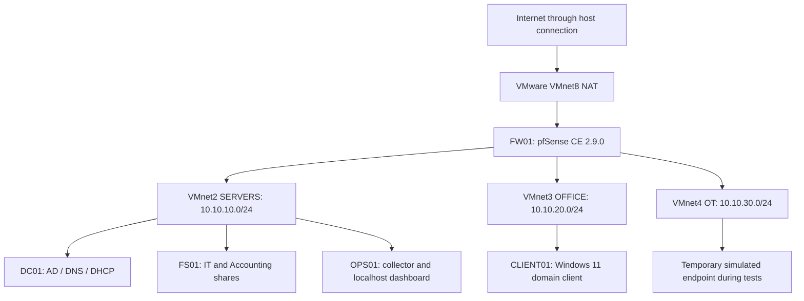

# Architecture and address plan

Current deployed state, corroborated through LAB-016 post-reboot validation. Earlier configuration captures and outstanding evidence details remain in their original tickets.

These are separate virtual subnets, not VLANs. All VMs share one physical host; this topology does not provide host redundancy.

## Networks and hosts

| Network | Role | Address space | VMware DHCP / host adapter |
|---|---|---|---|
| VMnet8 | NAT uplink | 192.168.170.0/24 operational WAN addressing | Enabled / enabled in initial capture |
| VMnet2 | SERVERS | 10.10.10.0/24 | Disabled / disabled |
| VMnet3 | OFFICE | 10.10.20.0/24 | Disabled / disabled |
| VMnet4 | OT | 10.10.30.0/24 | Disabled / disabled |

VMnet2's hypervisor mask was captured independently. Original hypervisor mask screenshots for VMnet3/4 and VMnet8 remain an evidence gap; later guest interface configuration and functional tests corroborate the deployed /24 address plan.

| Device | Network / interface | IPv4 | Gateway | DNS / role |
|---|---|---|---|---|
| FW01 WAN | VMnet8 / em0 | DHCP, observed 192.168.170.128 | VMware NAT uplink | FW01.home.arpa |
| FW01 SERVERS | VMnet2 / em1 | 10.10.10.1/24 | No upstream gateway on internal interface | Management and DC01 DNS forwarding |
| FW01 OFFICE | VMnet3 / em2 | 10.10.20.1/24 | No upstream gateway on internal interface | DHCP relay and Suricata sensor |
| FW01 OT | VMnet4 / em3 | 10.10.30.1/24 | No upstream gateway on internal interface | Default-deny segment |
| DC01 | VMnet2 | 10.10.10.10/24 | 10.10.10.1 | Domain DNS; forwarder 10.10.10.1 |
| FS01 | VMnet2 | 10.10.10.20/24 | 10.10.10.1 | DNS 10.10.10.10; department SMB shares |
| OPS01 | VMnet2 / ens33 | 10.10.10.30/24 | 10.10.10.1 | DNS 10.10.10.10; Linux operations |
| CLIENT01 | VMnet3 | Windows DHCP reservation 10.10.20.100/24 | 10.10.20.1 | DNS 10.10.10.10; domain client |

Only FW01 has an uplink adapter. OPS01 is single-homed. CLIENT01's temporary OT test address was removed and its OFFICE lease restored. There is no permanent OT guest.

## Identity, DHCP and file access

Domain: `corp.fischerlab.test`; NetBIOS: `FISCHERLAB`. DC01 is the first domain controller, running Windows Server 2022 Standard with AD-integrated DNS. Domain functionality is Windows Server 2016 mode.

FischerLab contains Users, Groups, Servers and Workstations OUs. User OUs cover IT, Accounting, Engineering, Design and Sales. The roster has 26 synthetic employees in five departmental global groups. A separate offboarding test identity remains disabled and is not part of the roster.

Windows DHCP on DC01 supplies the OFFICE scope 10.10.20.100–10.10.20.199 with an eight-day lease, router 10.10.20.1, DNS 10.10.10.10 and domain suffix. FW01 relays OFFICE DHCP to DC01. Client acquisition/reservation behavior is captured; a dedicated initial relay-settings/Windows-lease-table evidence set remains incomplete in LAB-005.

File authorization uses department global groups nested into domain-local resource groups. IT and Accounting shares combine scoped SMB and NTFS permissions. Group Policy targets I: and Q: mappings by department; permissions enforce access independently of the drive mapping. The baseline GPO supplies a sign-in notice and idle lock. Edge managed policy sets DNS-over-HTTPS mode off.

## Network controls and DNS filtering

OFFICE rules allow required DC01 services, FS01 TCP445 and CLIENT01-only OPS01 TCP22. Web egress uses TCP80/443 to destinations outside the RFC1918 alias. SERVERS rules preserve explicit DNS forwarding, relay, NTP and web access while blocking new connections to OFFICE and OT. Bootstrap/default broad allows remain disabled for rollback. Controlled allow/deny checks are documented in LAB-011/012; this is not an exhaustive rule audit.

Employee DNS follows CLIENT01 → DC01 → FW01 Unbound/pfBlockerNG. HaGeZi TIF Mini supplies threat domains; the custom group provides safe example.org test blocks. Null blocking returns 0.0.0.0. DNSBL VIP 10.10.40.1/32 is a localhost IP alias outside the deployed subnets. No broad ad/category filtering or IP/GeoIP block feeds were added. Browser policy and tested external DNS restrictions do not prove that every application, VPN or encrypted-DNS bypass is prevented.

## Intrusion detection and monitoring

Suricata GUI package 7.0.9_1 uses engine 8.0.5_1. One OFFICE/em2 sensor runs in alert-only mode, with blocking disabled. ET Open download succeeded; benign SID2100498 alerts were captured before and after reboot. Default HOME_NET includes the three internal /24s plus firewall/local/gateway host addresses. Automatic log management has a configured 512MB combined cap. Scheduled rotation and rule-update execution remain untested.

OPS01's unprivileged collector runs approximately every minute. The dashboard binds only 127.0.0.1:8080; CLIENT01 reaches it through an SSH tunnel. Six DNS/TCP probes, host resources and snapshot freshness are shown. Same-subnet SERVERS traffic bypasses FW01 inspection; encrypted application content is not decrypted.

## Resources and recovery

Host specifications are user-reported: i9-9900K, 32GB RAM and 1TB storage. FW01 has two virtual CPUs and approximately4GiB guest RAM, corroborated after reboot. Other initial VM allocations are not treated as verified current allocations.

FS01's dedicated E: virtual disk stores the tested file backup. Encrypted FW01 exports remain in private host storage, outside the portfolio; six checkpoints are recorded through LAB-014. File restore preserved the original hash and ACL. Earlier same-version firewall recovery and staged upgrades are documented; the newest checkpoint has not been restored. Same-host storage is not off-site recovery.

## Evidence map

- [Network foundation](../tickets/001-network-foundation.md), [AD deployment](../tickets/002-active-directory.md), [DHCP](../tickets/005-office-dhcp.md)
- [Firewall controls](../tickets/011-firewall-hardening.md), [recovery/upgrade](../tickets/012-firewall-configuration-recovery.md), [DNS filtering](../tickets/013-employee-network-access.md)
- [IDS](../tickets/014-suricata-intrusion-detection.md), [offboarding](../tickets/015-employee-offboarding.md), [post-reboot validation](../tickets/016-post-reboot-validation.md)
