# LAB-001 screenshot evidence

## E05 — DC01 connectivity validation

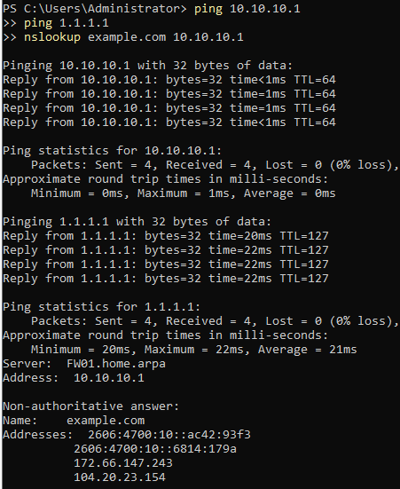

DC01 receives 4/4 replies from 10.10.10.1 and 1.1.1.1 with 0% loss. External ping average is 21 ms. nslookup example.com 10.10.10.1 returns IPv4 and IPv6 records through FW01.home.arpa. DNS AAAA answers do not prove IPv6 connectivity. These checks validate this client's tested gateway, outbound IPv4 ICMP, and DNS path; they do not establish cross-network firewall isolation or general application access.

## E08 — WAN configuration

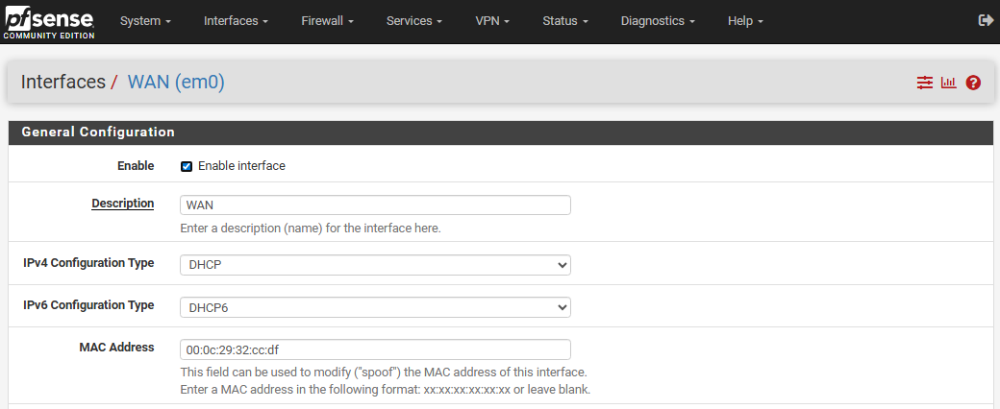

WAN em0 is enabled with IPv4 DHCP, IPv6 DHCP6, and a MAC override matching the recorded VMware WAN MAC. Filtering checkboxes and saved-state confirmation are not visible.

## E09 — SERVERS DHCP disabled

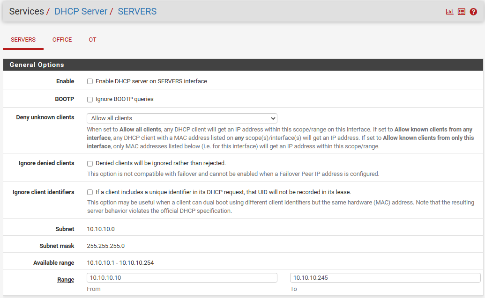

Enable DHCP server is unchecked on SERVERS. The displayed range overlaps planned static server addresses, but is inactive while disabled. OFFICE and OT status are not shown; previous state before any changes is unknown.

Captured and supplied by Kyle Fischer on October 6, 2026. Original screenshots are preserved without alteration. These show configuration; they do not establish successful routing or firewall isolation.

## E10–E13 — Interface configuration review

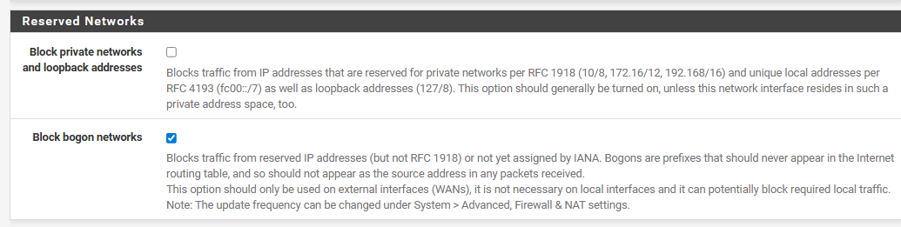

Capture supplied for WAN shows private-network and loopback blocking unchecked, bogon blocking checked. Page header and saved-state confirmation are outside this crop.

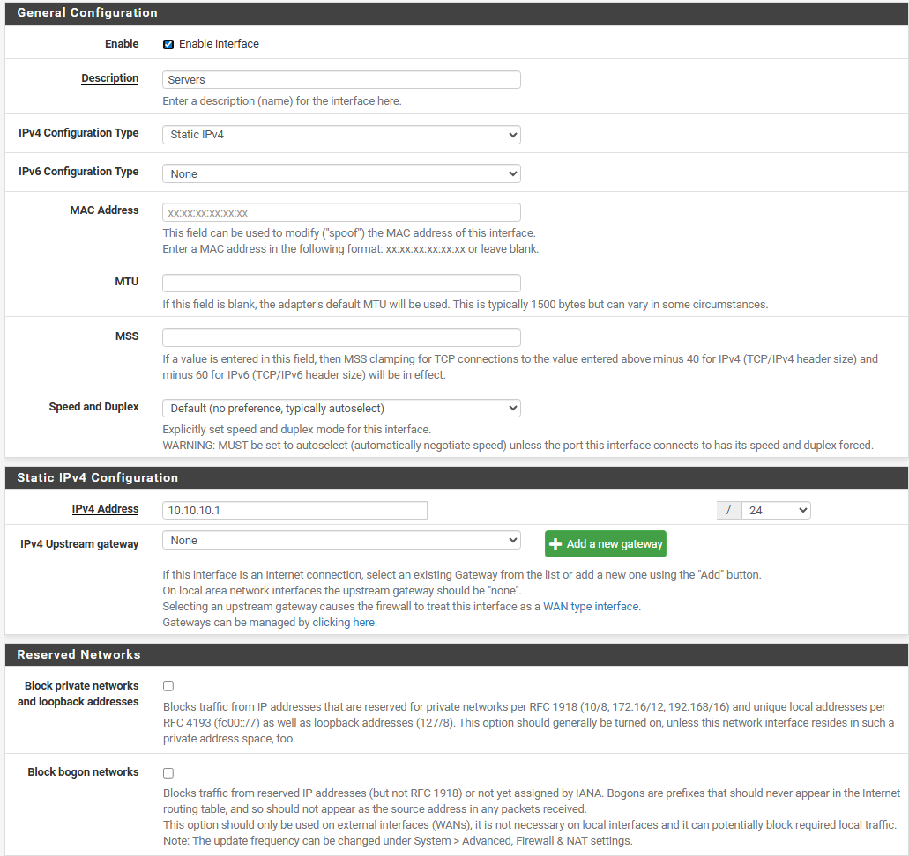

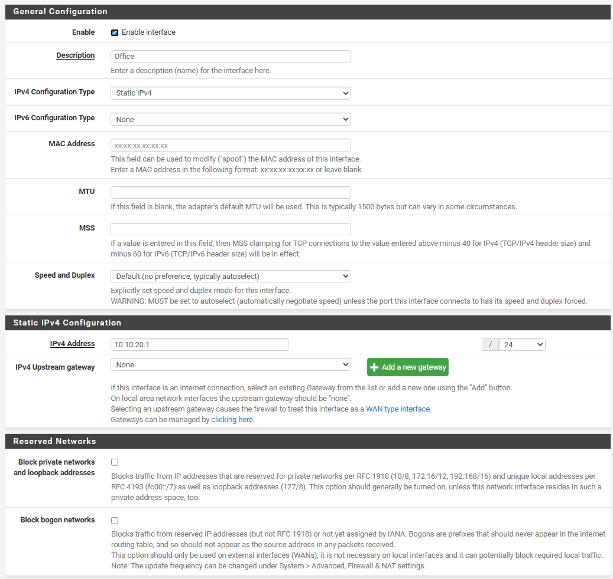

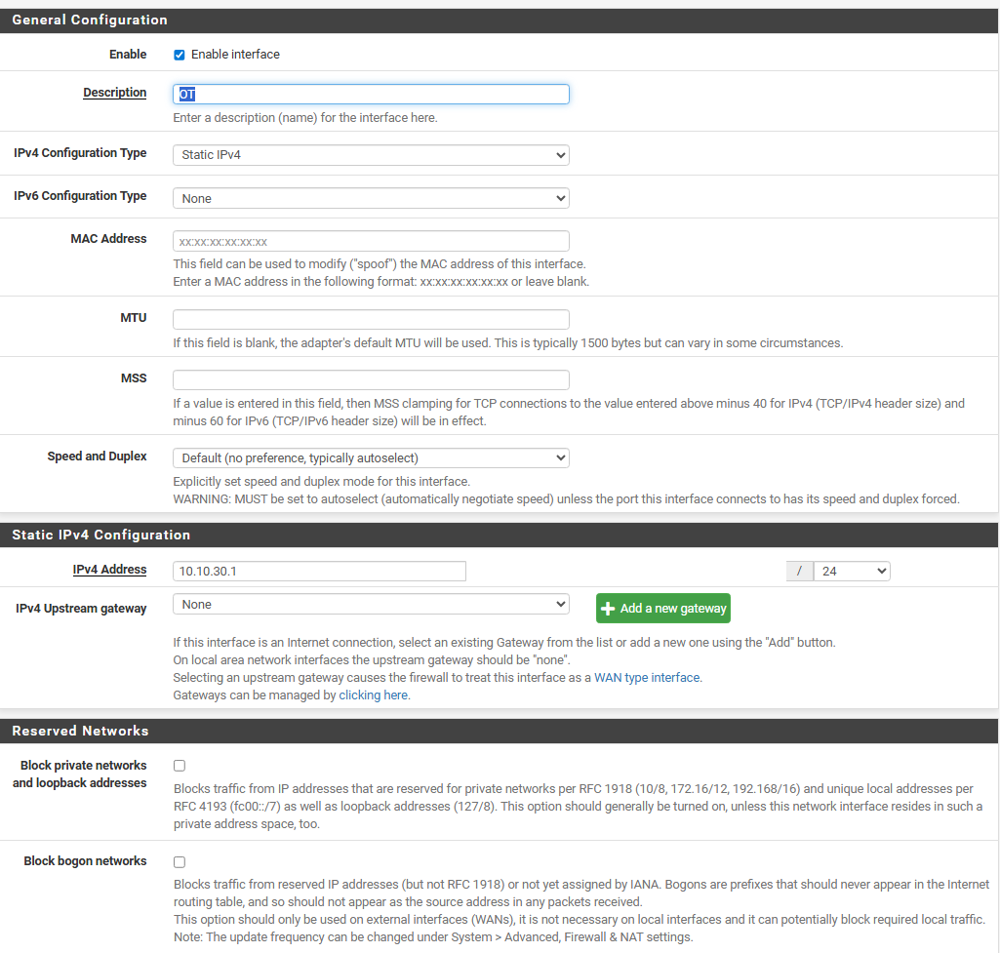

All three internal interfaces are enabled, use planned gateway addresses with /24 prefixes, set IPv6 to None, and have no upstream gateway. Private-network and bogon blocking are unchecked. MAC override fields are empty. These forms do not show DHCP server status or prove firewall isolation.

## E01 — Virtual network configuration

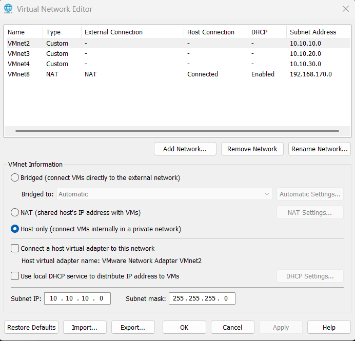

VMnet2/3/4 use separate subnet addresses and show no host connection or VMware DHCP service. VMnet2 is selected and confirms Host-only configuration, unchecked host adapter and DHCP options, and 255.255.255.0 mask. VMnet3/4 masks are not visible. VMnet8 remains NAT with host connection and DHCP enabled.

## E02 — FW01 adapter mapping

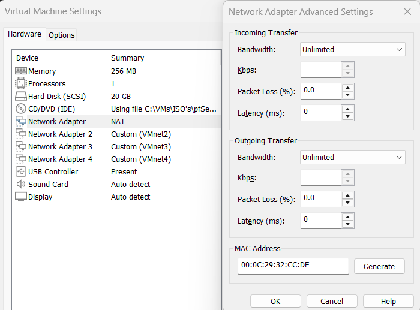

Adapter 1 shows NAT with MAC 00:0C:29:32:CC:DF; Kyle identifies it as VMnet8. Intended role: WAN. This capture still shows 256 MB RAM; requested resource correction remains unverified.

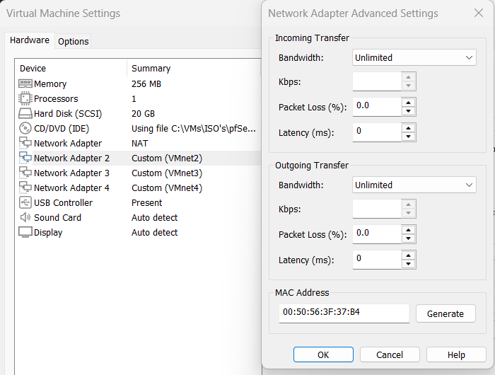

Adapter 2 connects to VMnet2 with MAC 00:50:56:3F:37:B4; intended Servers / LAN interface.

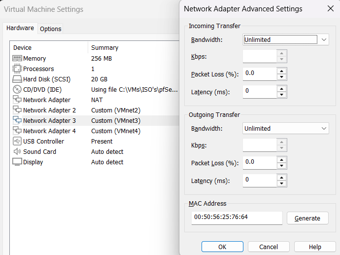

Adapter 3 connects to VMnet3 with MAC 00:50:56:25:76:64; intended Office / OPT1 interface.

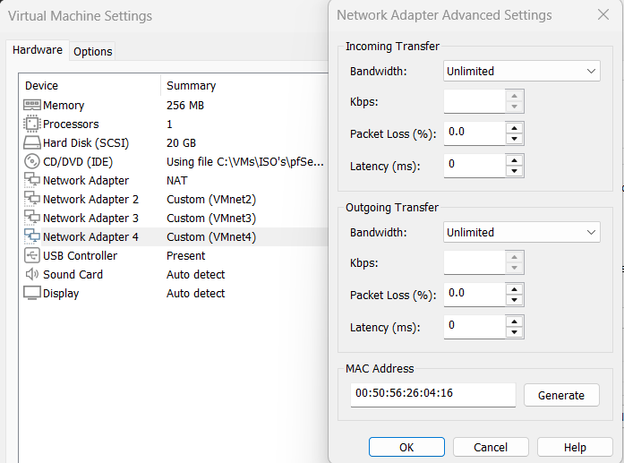

Adapter 4 connects to VMnet4 with MAC 00:50:56:26:04:16; intended Field / OPT2 interface.

All adapter screenshots show FW01 with 256 MB RAM, 1 processor, a 20 GB disk, and attached ISO media. Resource adjustment is requested before boot. Actual pfSense interface names remain unverified.

## E04 — FW01 console address checkpoint

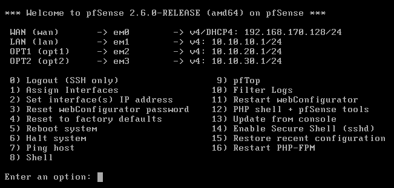

pfSense 2.6.0-RELEASE displays WAN em0 with DHCP lease 192.168.170.128/24 and the planned internal gateways: LAN em1 10.10.10.1/24, OPT1 em2 10.10.20.1/24, OPT2 em3 10.10.30.1/24. This verifies displayed address configuration. It does not show MAC addresses, resource changes, DHCP server status, firewall policy, or successful connectivity.

## E06 — DC01 bootstrap IPv4 settings

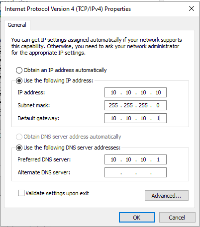

The IPv4 properties dialog shows static address 10.10.10.10, mask 255.255.255.0, gateway 10.10.10.1, and temporary preferred DNS 10.10.10.1; alternate DNS is blank. These entered values match the bootstrap plan. The open dialog does not prove the settings were applied or that connectivity works. DNS will be revised during AD deployment.

## E07 — Management access and resource correction

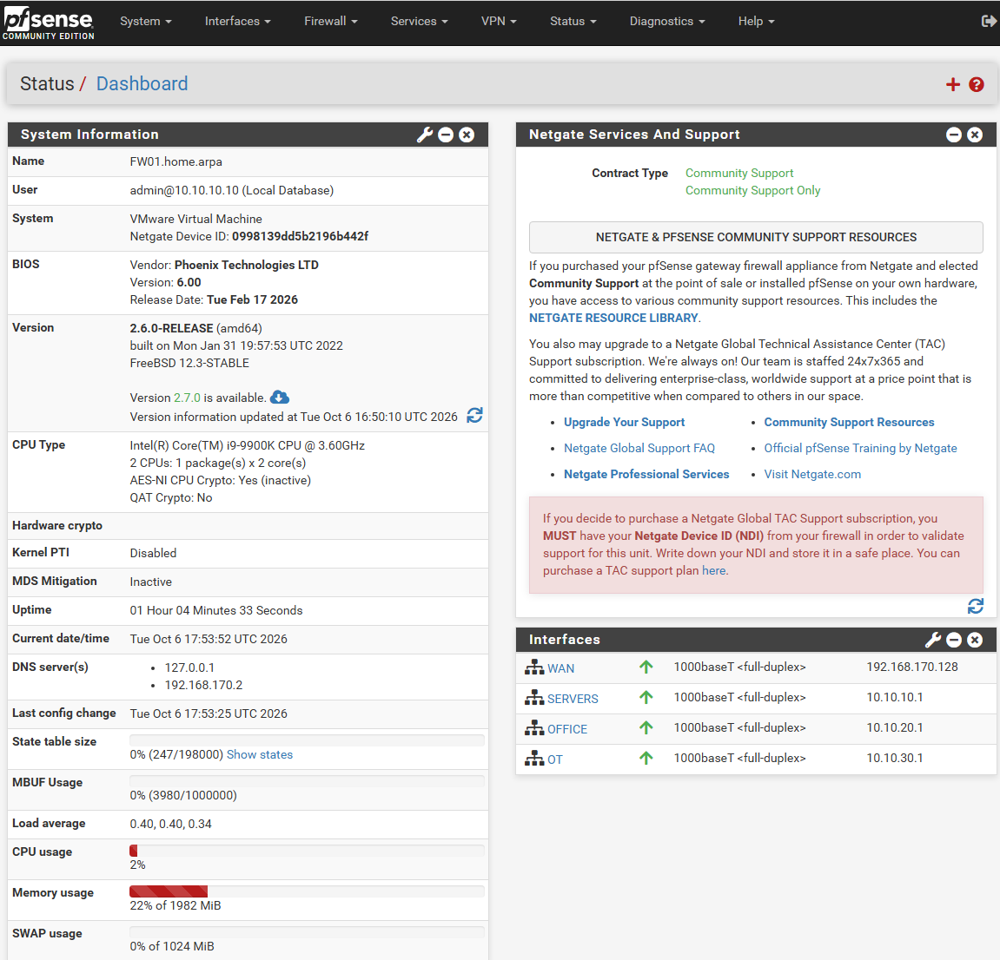

Dashboard shows FW01.home.arpa, authenticated admin session from 10.10.10.10, 2 CPUs (1 package x 2 cores), and 1982 MiB visible RAM. WAN, SERVERS, OFFICE, and OT display up status and the expected addresses. This verifies web management access from DC01 and the CPU/RAM correction. It does not prove internet access, DNS resolution, or isolation between networks. The installed version remains 2.6.0; its displayed 2.7.0 update offer is not evidence of the latest available release.
