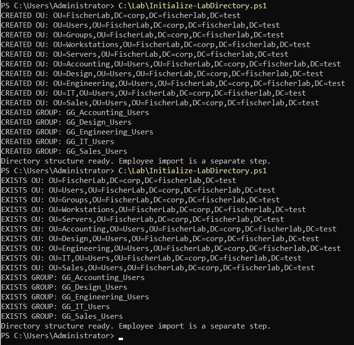
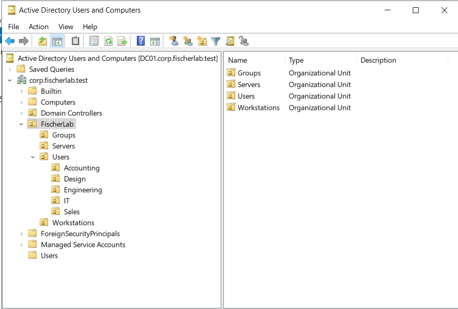
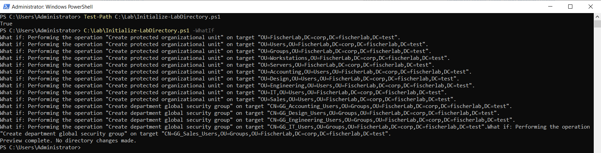
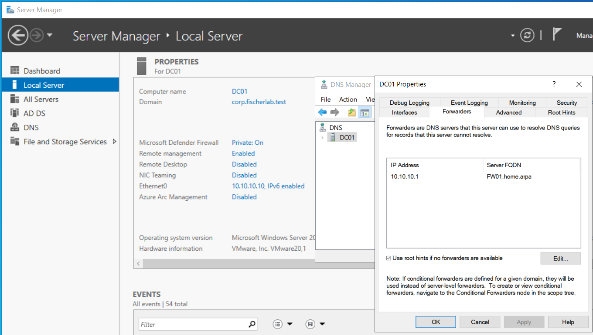
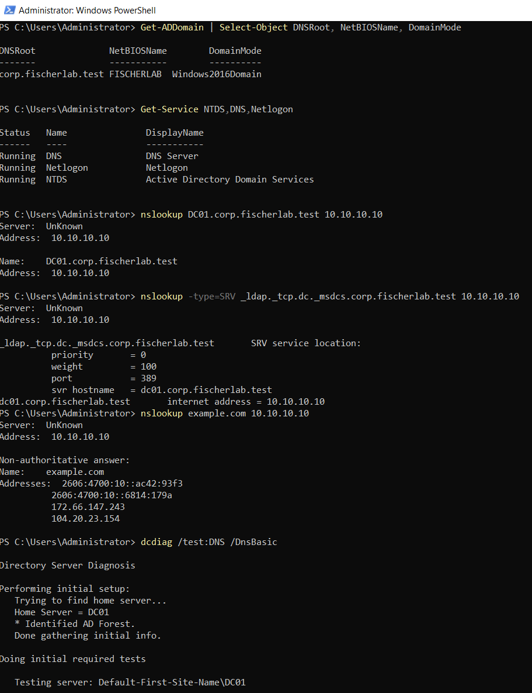
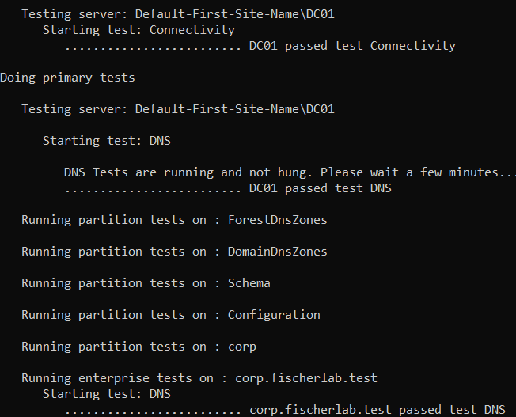
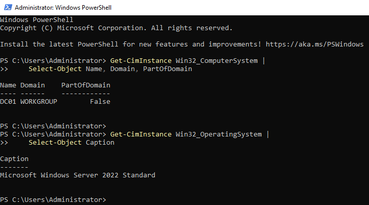
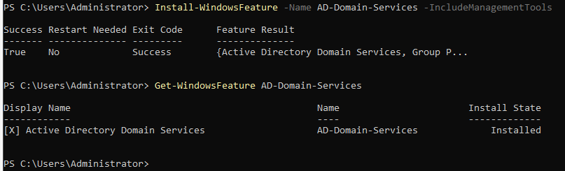
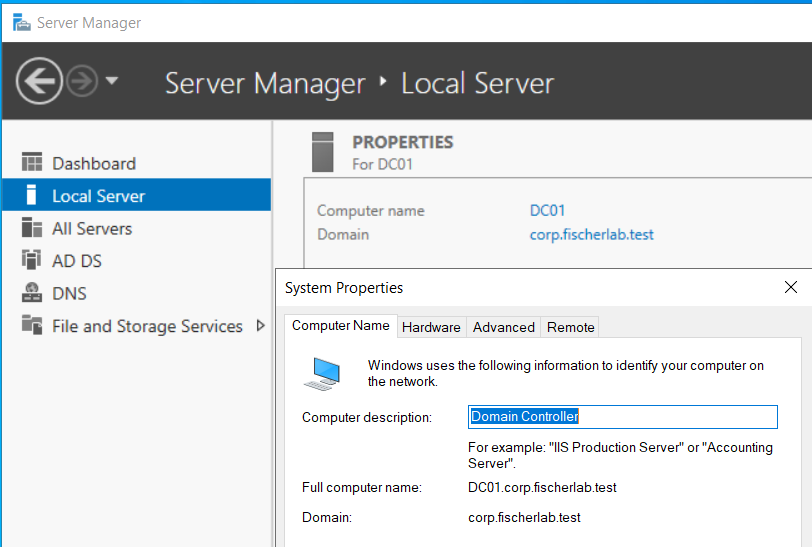

# LAB-002 evidence

## E08/E09 — Directory creation and duplicate avoidance (LAB-003)

First saved-file execution reports CREATED for ten OUs and five global security groups. Second execution reports EXISTS for all fifteen objects, with no visible errors. This demonstrates the script's successful apply and existing-object handling for this lab state. Group properties and employee membership are validated separately.

ADUC displays FischerLab with Groups, Servers, Users, and Workstations; Users contains Accounting, Design, Engineering, IT, and Sales. The screenshot verifies the OU hierarchy. It does not show employee accounts, group properties, or the contents of Domain Controllers.

## E07 — Directory structure preview (LAB-003)

Test-Path confirms C:\Lab\Initialize-LabDirectory.ps1 exists. Invoking the saved script with -WhatIf displays creation plans for ten protected OUs and five department global security groups, then reports no directory changes made. The previous null PSCmdlet error is absent. This validates preview execution, not actual object creation or employee provisioning. Stored here alongside DC01 evidence; activity belongs to LAB-003.

## E04–E06 — AD and DNS validation

DNS forwarder 10.10.10.1 is displayed as FW01.home.arpa; root-hints fallback is enabled.

Get-ADDomain confirms corp.fischerlab.test, NetBIOS FISCHERLAB, and Windows2016Domain. DNS, Netlogon, and NTDS are Running. DC01's host record resolves to 10.10.10.10; the LDAP SRV query returns dc01.corp.fischerlab.test at port 389. example.com resolves through DC01. Explicit DNS server arguments prove these queries against DC01, not the adapter's preferred DNS configuration.

dcdiag /test:DNS /DnsBasic reports DC01 passed Connectivity and DNS and the domain passed DNS. This is basic DNS validation, not a full domain-controller health audit. nslookup reports Server: Unknown, suggesting a missing PTR for 10.10.10.10; reverse-zone inspection and correction are pending. No forward-resolution failure is shown.

## E01 — DC01 identity and OS preflight

Supplied October 6, 2026. Elevated Windows PowerShell output confirms actual computer name DC01, WORKGROUP membership, PartOfDomain=False, and Microsoft Windows Server 2022 Standard. This supports proceeding with new-forest preparation. AD DS role installation and domain-controller promotion are not yet demonstrated.

## E02 — AD DS role installation

Install-WindowsFeature -Name AD-Domain-Services -IncludeManagementTools returns Success=True, Restart Needed=No, Exit Code=Success. Get-WindowsFeature confirms Installed state. This verifies role installation; it does not establish that DC01 has been promoted or that domain DNS is functional.

## E03 — Domain identity after restart

Kyle reports completing the restart. Server Manager and System Properties display domain corp.fischerlab.test and full computer name DC01.corp.fischerlab.test. AD DS and DNS appear in Server Manager. This captures post-deployment domain identity; service health, functional levels, NetBIOS identity, domain DNS records, and SYSVOL readiness require separate validation. Promotion review and prerequisite screenshots have not been supplied.
