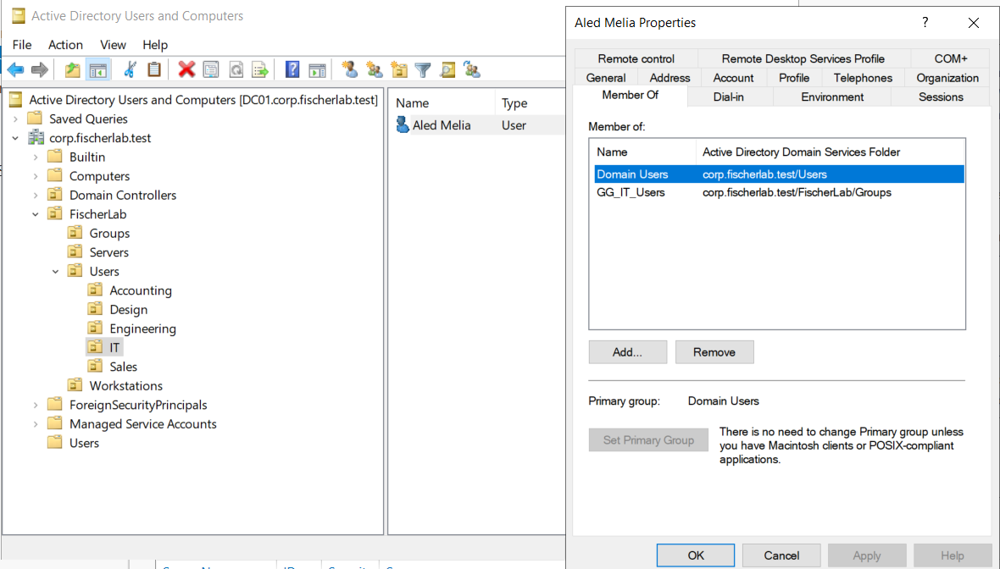
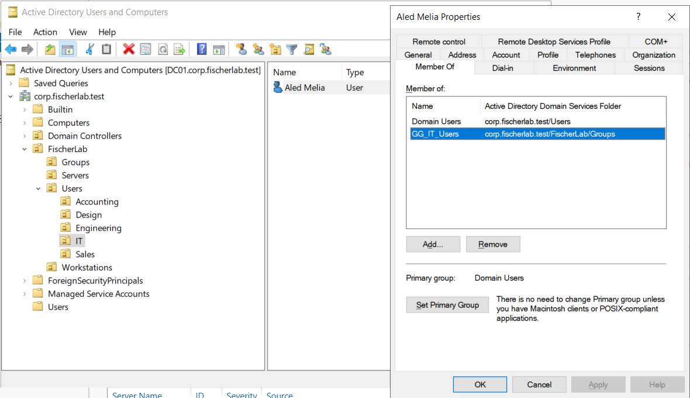
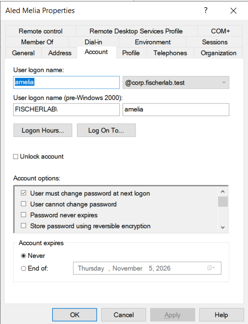

# LAB-003 — Pilot employee evidence

Supplied October 6, 2026. Account is a synthetic lab employee, not a real production identity.

ADUC shows Aled Melia under FischerLab/Users/IT. Member Of displays Domain Users (primary group) and GG_IT_Users. No administrative group membership is displayed; nested/effective privileges are not independently audited.

Additional capture of the same membership, highlighting GG_IT_Users in FischerLab/Groups. Preserved as supplementary evidence; the first capture is sufficient for the main portfolio narrative.

Account tab shows amelia@corp.fischerlab.test and FISCHERLAB/amelia. User must change password at next logon is checked; cannot change password, password never expires, and reversible encryption are unchecked. The disabled-account flag is not visible in the scrolled account-options area. Account enabled state and actual workstation sign-in require separate checks. No password is exposed.
# Bulk import checkpoints

- `008-final-employee-verification.png`: All26 row checks true; roster26/AD26/failed0/extras0; department and direct GG user counts Accounting5/Design7/Engineering2/IT5/Sales7. New-account policy exempts pilots; final PASS message is outside capture, but its predicates are shown.

- `007-no-change-import-rerun.png`: Rerun shows26 existing/0 new accounts and all rows EXISTS - NO CHANGE, with no password prompt or visible errors. Independent summary of extras/counts/new-account password policy still pending.

- `006-employee-import-applied.png`: Apply output reports24 creations with departmental GG additions and2 pilot Department updates. Temporary password input is masked. Final directory-state checks and no-change rerun remain pending.

- `004-pre-import-account-inventory.png`: DC01 search under FischerLab/Users shows only enabled amelia and omora; both Department attributes blank.
- `005-domain-import-preview.png`: Actual saved-file domain preview shows26 roster rows,24 planned creations and2 existing pilot metadata/group actions, and explicitly confirms no AD changes applied.
