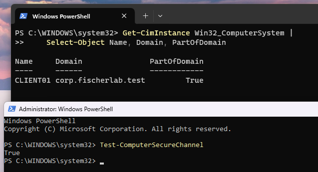
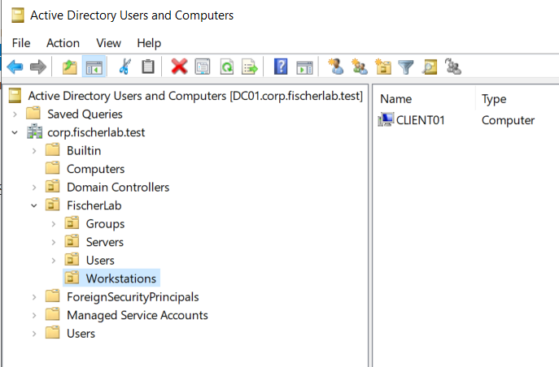
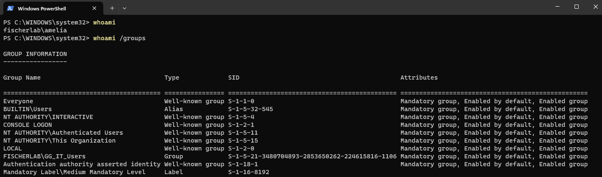
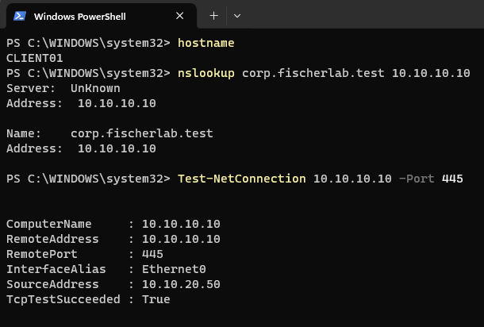
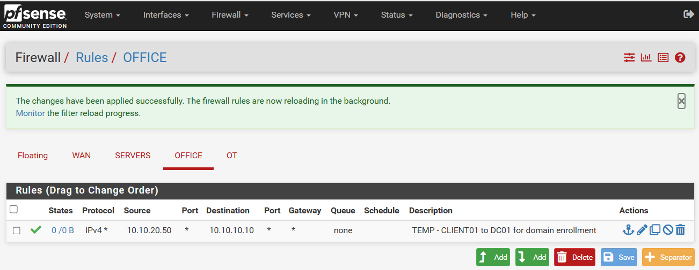
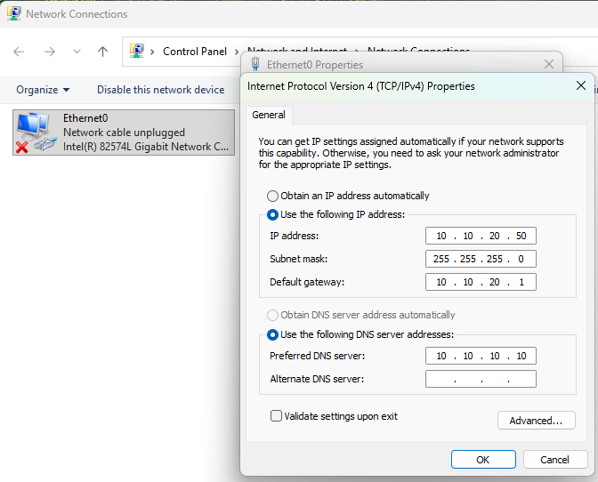
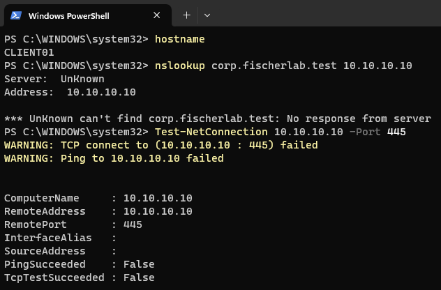

# LAB-004 — Client networking evidence

## E06/E07 — Domain membership, trust, and workstation OU

Get-CimInstance Win32_ComputerSystem returns Name CLIENT01, Domain corp.fischerlab.test, PartOfDomain=True. Elevated Test-ComputerSecureChannel returns True, validating the domain trust at test time.

ADUC shows CLIENT01 as a Computer object inside FischerLab/Workstations. This verifies placement for workstation-targeted Group Policy. Pilot password-change confirmation is tracked separately under LAB-003.

## E05 — Pilot domain session and department token

whoami returns fischerlab\amelia. whoami /groups includes FISCHERLAB\GG_IT_Users, BUILTIN\Users, and Medium Mandatory Level. No administrator group is displayed in this capture. This verifies the displayed domain-user session and department token. The host name is not in the frame; CLIENT01 association follows the guided task context, not independent host output. Domain-join confirmation, password-change completion, secure-channel validation, and workstation OU placement are not independently captured.

## E04 — Client connectivity restored

CLIENT01 now resolves corp.fischerlab.test to 10.10.10.10 using DC01 DNS. TCP 445 returns TcpTestSucceeded=True with InterfaceAlias Ethernet0 and SourceAddress 10.10.20.50. This validates recovery for the tested paths, not DHCP, all AD services, domain join, or employee sign-in. The exact VMware adapter correction was not captured.

## E01 — OFFICE bootstrap rule

Applied rule permits any IPv4 protocol from 10.10.20.50 to DC01 at 10.10.10.10. The temporary description is visible and states are zero at capture time. Rule source must be adapted when using a DHCP address; final service restriction remains pending.

## E02 — Static settings with disconnected link

Entered static address 10.10.20.50/24, gateway 10.10.20.1, preferred DNS 10.10.10.10. Behind the dialog Ethernet0 reports Network cable unplugged. Entered values do not establish applied settings or active connectivity.

## E03 — Failed connection tests

hostname returns CLIENT01. Query to DC01 receives no response; TCP 445 and ping fail. SourceAddress and InterfaceAlias are blank. These tests occurred while the supplied guest screenshot showed a disconnected link. Recovery validation is pending.
