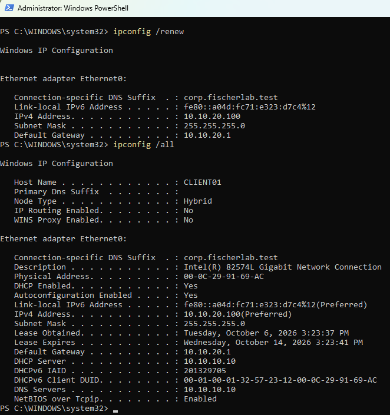
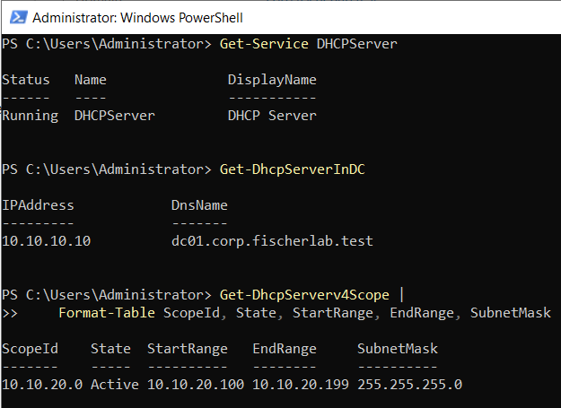
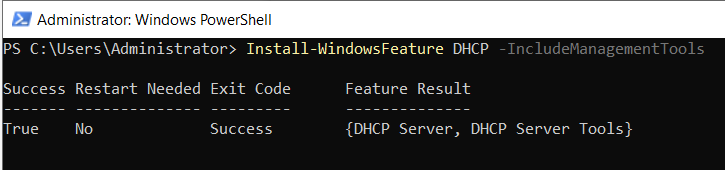
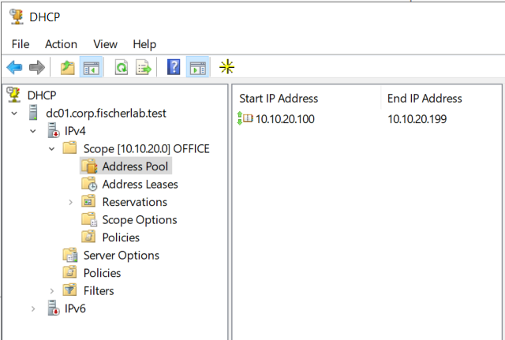
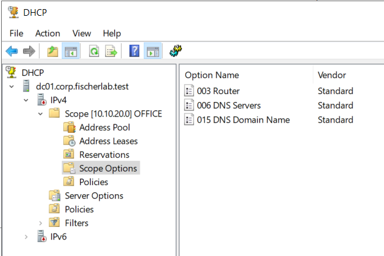
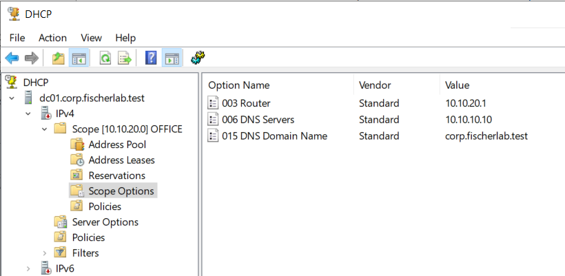

# LAB-005 — OFFICE DHCP evidence

## E06 — CLIENT01 lease acquired from DC01

ipconfig /renew succeeds. ipconfig /all identifies CLIENT01 Ethernet0, MAC 00-0C-29-91-69-AC, DHCP Enabled=Yes, IPv4 10.10.20.100, mask 255.255.255.0, gateway 10.10.20.1, DHCP Server 10.10.10.10, DNS Server 10.10.10.10, and connection-specific suffix corp.fischerlab.test. Lease timestamps are October 6–14, 2026. This verifies client-side DHCP delivery across the office/server subnet boundary. Saved pfSense relay settings, updated OFFICE rule, and matching Windows DHCP lease entry remain uncaptured. Domain enrollment and connectivity from the leased address are separate tests.

## E05 — Service, AD authorization, and scope activation

DHCPServer is Running. Get-DhcpServerInDC lists 10.10.10.10 / dc01.corp.fischerlab.test. OFFICE scope 10.10.20.0 is Active with pool 10.10.20.100–10.10.20.199 and mask 255.255.255.0. These checks verify server readiness; relay operation and client lease acquisition remain pending.

## E01 — DHCP role installed

Install-WindowsFeature DHCP -IncludeManagementTools returns Success=True, Restart Needed=No, Exit Code=Success. Role installation is verified; authorization and running service status are separate checks.

## E02 — OFFICE address pool

Scope 10.10.20.0 is named OFFICE. Pool start is 10.10.20.100 and end is 10.10.20.199, matching the design. Subnet mask, lease duration, activation, and authorization are not established by this view. IPv4 node displays a red downward indicator; status must be verified with actual service, authorization, and scope queries rather than inferred from the icon alone.

## E03 — Scope options listed

Options 003 Router, 006 DNS Servers, and 015 DNS Domain Name are present. Their configured values are outside the screenshot. Option-value verification is pending.

## E04 — Scope option values verified

Improved capture verifies 003 Router = 10.10.20.1, 006 DNS Servers = 10.10.10.10, and 015 DNS Domain Name = corp.fischerlab.test. Use this capture for the main portfolio options evidence; retain E03 as the earlier partial capture. Service status, authorization, and scope state still require separate checks.
