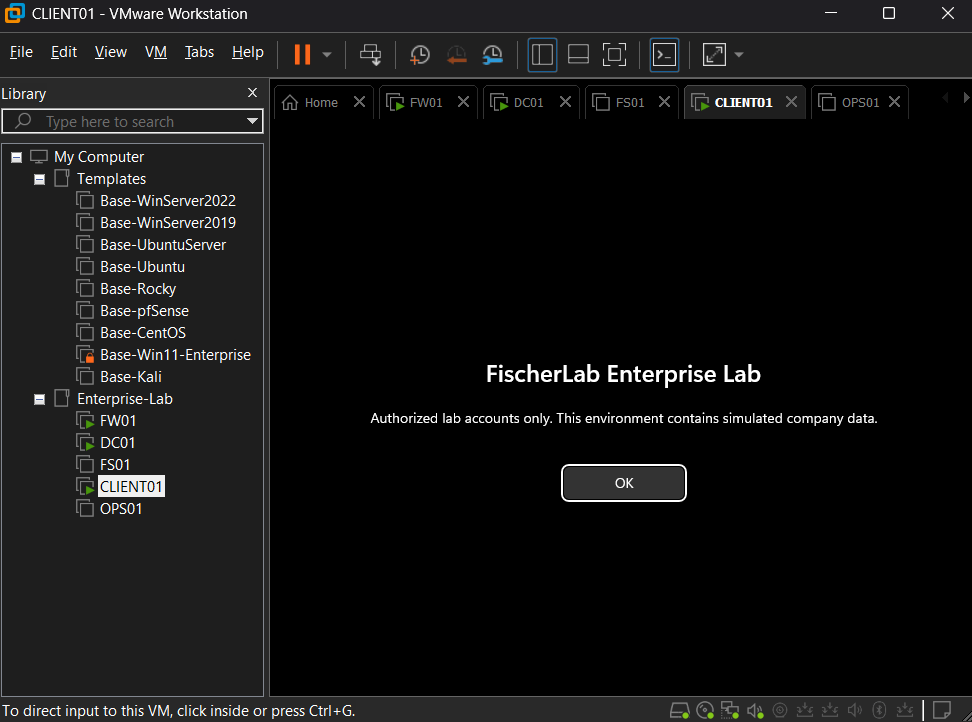
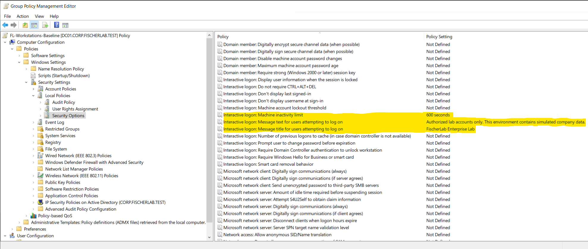
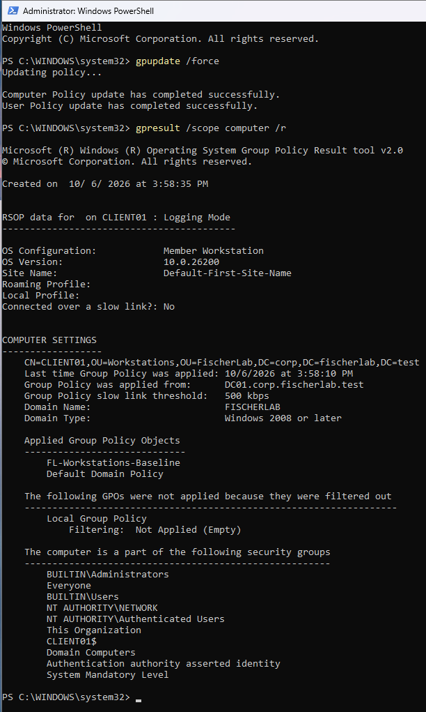

# LAB-006 — Workstation policy evidence

## E03 — Visible sign-in notice

VMware window identifies CLIENT01, with the configured title and message displayed at sign-in. Notice behavior verified. Kyle also reports that the screen went black after ten minutes and the lock works; no timed lock capture or credential requirement on wake was supplied. Record inactivity behavior as user-reported, with lock versus display-blanking confirmation pending. This image shows the notice, not the idle-lock event.

## E01 — Policy configuration

Supplied highlighted editor capture shows FL-Workstations-Baseline with machine inactivity limit 600 seconds, notice title FischerLab Enterprise Lab, and notice text Authorized lab accounts only. This environment contains simulated company data. Other visible security settings remain Not Defined. This verifies GPO configuration, not a comprehensive security baseline or actual timed-lock behavior.

## E02 — Policy application on CLIENT01

gpupdate /force reports successful computer and user policy updates. Elevated gpresult /scope computer /r identifies CLIENT01 in OU=Workstations,OU=FischerLab,DC=corp,DC=fischerlab,DC=test, with policy applied from DC01.corp.fischerlab.test. Applied GPOs include FL-Workstations-Baseline and Default Domain Policy. Local Group Policy is filtered out as empty; this is not a failed domain policy. Notice display and timed inactivity behavior remain pending.
