# LAB-007 — File server evidence

## E25 — Existing-file modification validated

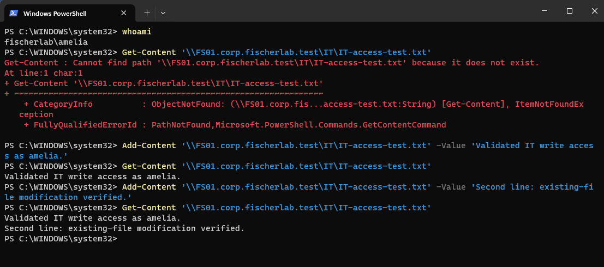

The ongoing fischerlab\amelia session appends Second line: existing-file modification verified. to the previously created file. Final Get-Content displays both the original and second lines. IT create/read/modify operation checks now pass, correlated with E24; Accounting denial is E23. Earlier PathNotFound remains visible as historical context, followed by successful creation, modification, and readback.

## E24 — Employee file creation and readback

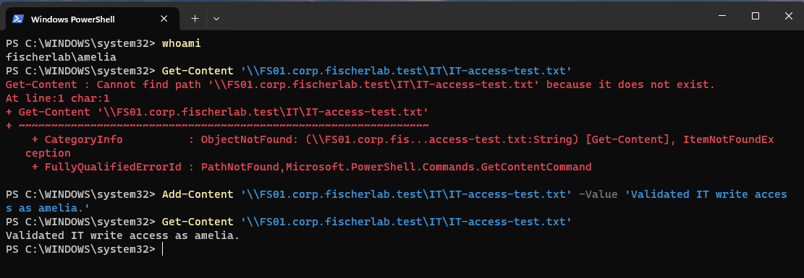

whoami confirms fischerlab\amelia. First Get-Content reports PathNotFound for the exact IT-access-test.txt path. Subsequent Add-Content succeeds and creates that file; final Get-Content returns Validated IT write access as amelia. This verifies file creation/write and readback at the specified UNC path. It does not demonstrate appending to an already existing file because the initial read showed the path absent. The earlier Explorer capture had a visible test filename, but the discrepancy cause (for example extension or rename) is not established. One subsequent append/read will validate existing-file modification. No authorization failure is displayed for the successful operations.

## E23 — Accounting access denied

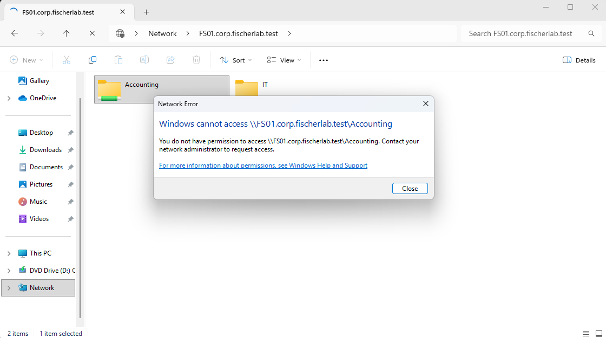

Final Explorer error explicitly states You do not have permission to access \\FS01.corp.fischerlab.test\Accounting. In the guided amelia session, with prior same-server TCP/IT access established by E20/E21, this validates the expected cross-department authorization denial. The screenshot does not display the user identity itself; correlate with E20 rather than claiming independent identity proof from this frame. A duplicate PowerShell Accounting test is not required.

## E19–E22 — OFFICE SMB and pilot access tests

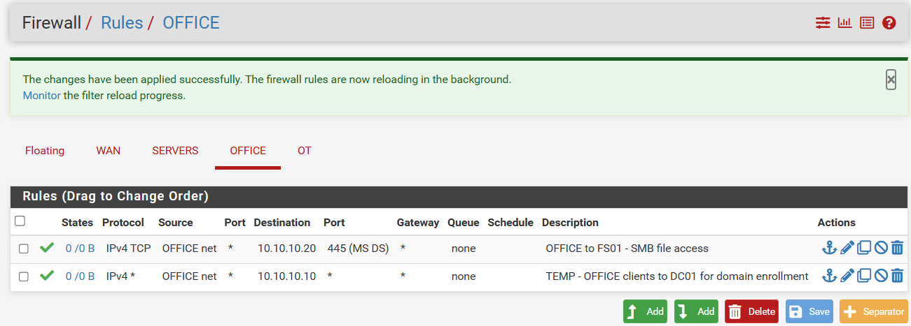

OFFICE net to 10.10.10.20 TCP destination 445 is permitted by a dedicated applied rule. The temporary OFFICE-net-to-DC01 any-IPv4 rule is also visible, corroborating the prior DHCP-source migration. Final AD port restrictions remain pending.

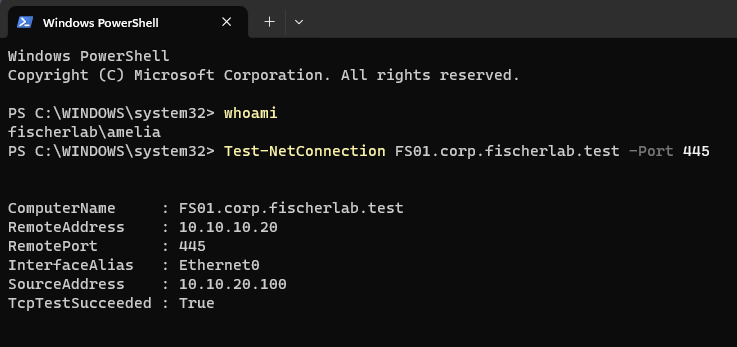

whoami=fischerlab\amelia. TCP 445 to FS01.corp.fischerlab.test resolves 10.10.10.20 and succeeds from 10.10.20.100 / Ethernet0. This verifies the test identity, name resolution, and network reachability.

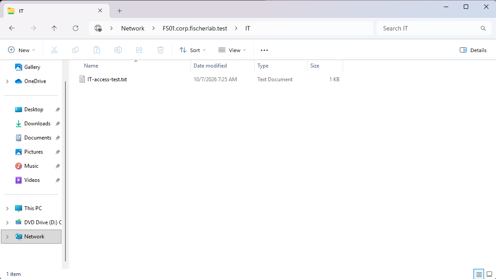

Explorer displays IT on FS01.corp.fischerlab.test and IT-access-test.txt. This proves the share can be browsed in the guided employee-session context and the file exists. File creation ownership, read output, and a saved edit are not independently visible; collect explicit read/append/read results for operation-level verification.

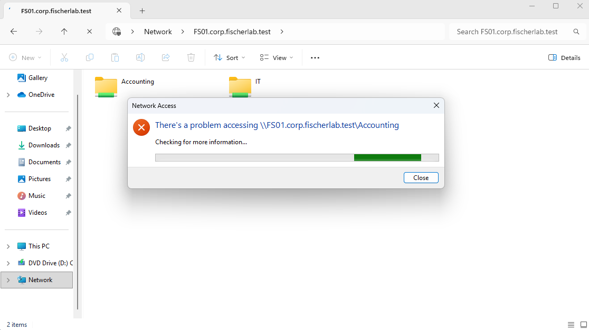

Explorer reports a problem accessing Accounting and is still Checking for more information. It does not display a completed Access denied result or specific error code. Record Accounting access failure as observed, but do not classify it conclusively as expected authorization denial until the final error is captured.

## E17/E18 — Corrected share administrative groups

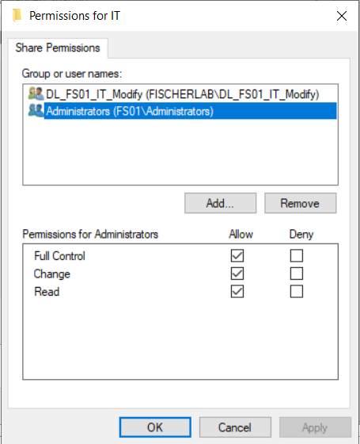

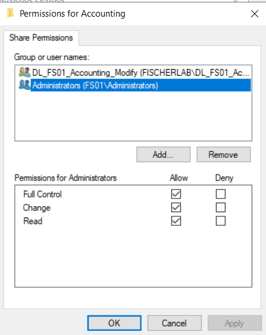

Both share dialogs now show Administrators (FS01\Administrators) with Full Control, Change, and Read checked. Individual FS01\Administrator is absent; matching domain-local department group remains. Apply is disabled in each capture. This confirms the corrected administrative principal as displayed; client resource access tests remain pending. Earlier captures document department group Change/Read settings, which are not selected in these views.

## E16 — Local group lookup against domain location

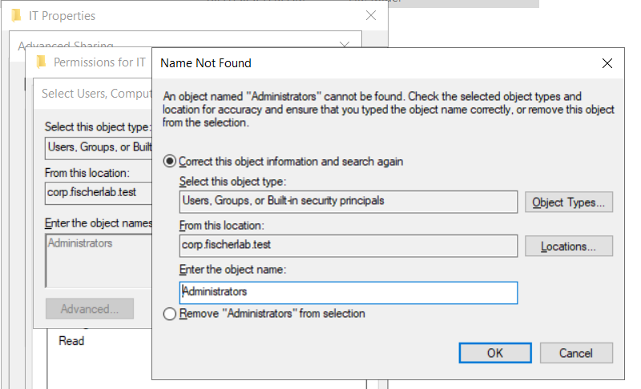

Name Not Found dialog shows entered Administrators, object types including Groups, and location corp.fischerlab.test. This identifies the current lookup scope as the domain rather than the intended FS01 local security database. Requested correction: select FS01 in Locations, then check Administrators again. Resolution and revised ACL capture are pending.

## E10/E11 — Department folder NTFS permissions

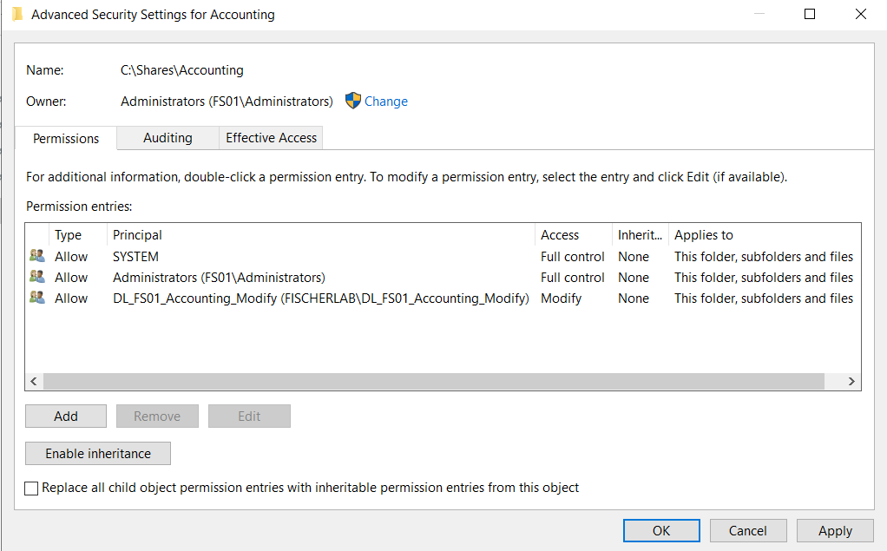

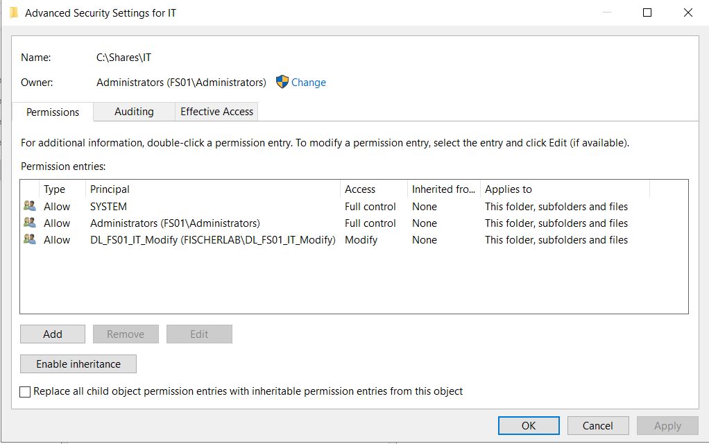

C:\Shares\Accounting and C:\Shares\IT show inheritance disabled and three explicit Allow entries: SYSTEM Full control, FS01 local Administrators Full control, and matching domain-local resource group Modify, applying to this folder/subfolders/files. Accounting Apply is enabled in the capture, so saving and reopening remains necessary to establish persisted settings. IT Apply is disabled. No broad employee entries or explicit Deny entries are displayed.

## E12–E15 — Share permissions and administrative principal discrepancy

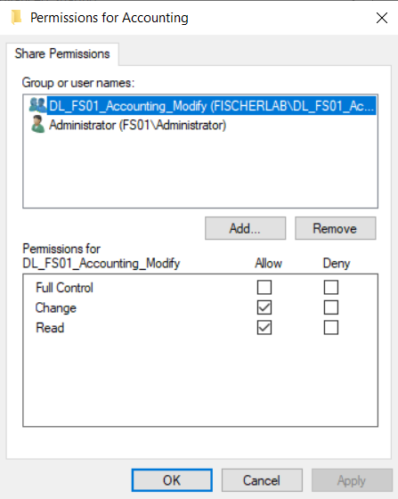

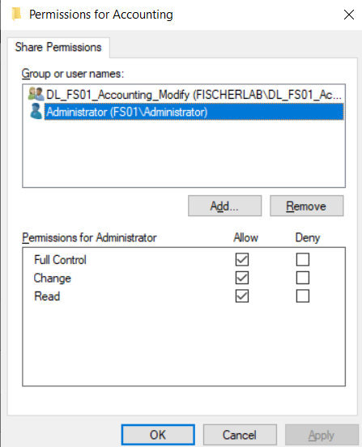

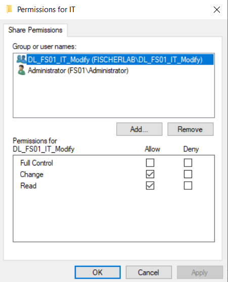

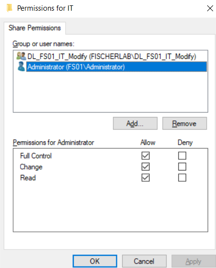

Both shares grant matching department resource group Change/Read without Full Control or Deny. Everyone is absent. Administrative Full Control is assigned to individual FS01\Administrator, not the planned local Administrators group. Correct by adding FS01 local Administrators Full Control before removing the individual account; retain department permissions. Actual correction and client access tests remain pending. File Server role installation output was not supplied.

## E05–E08 — Resource groups and department nesting

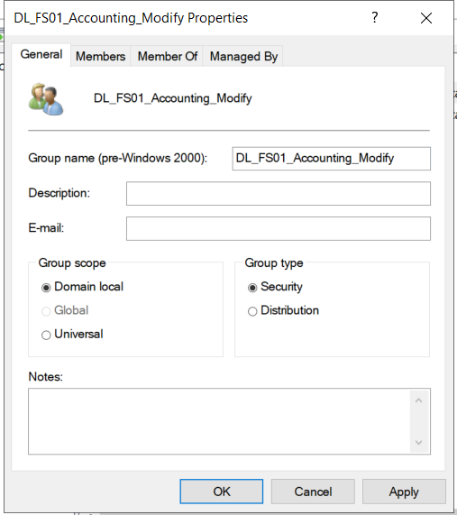

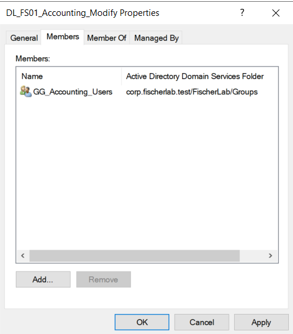

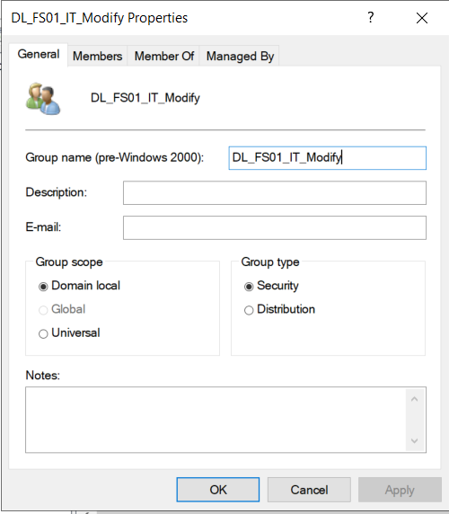

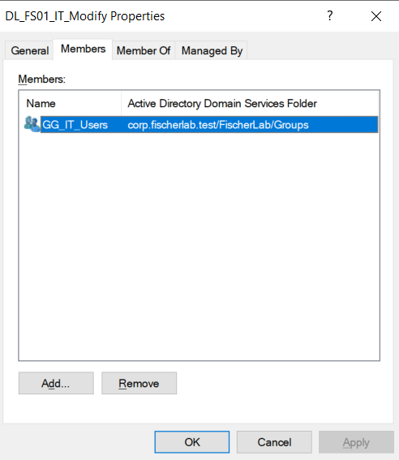

Supplied October 7, 2026. DL_FS01_Accounting_Modify and DL_FS01_IT_Modify show Domain local scope and Security type. Members tabs contain GG_Accounting_Users and GG_IT_Users respectively. This validates displayed group design and nesting. Accounting tabs show Apply enabled, so saved membership should be confirmed when the dialog is reopened or permissions are tested. No resource permissions or employee access tests are established by these captures.

## E09 — FS01 network and role precheck

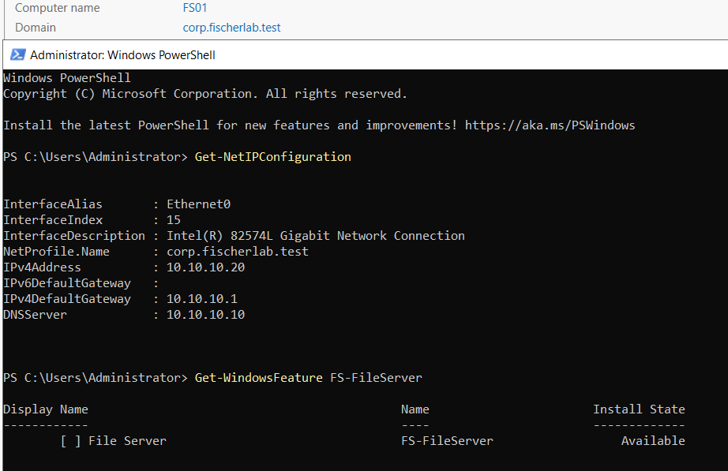

FS01 Ethernet0 shows IPv4 10.10.10.20, gateway 10.10.10.1, DNS 10.10.10.10, and domain network profile corp.fischerlab.test. Subnet prefix is not displayed by this command. FS-FileServer is Available, meaning it is not yet installed. Installation is the next step.

## E01 — FS01 preflight

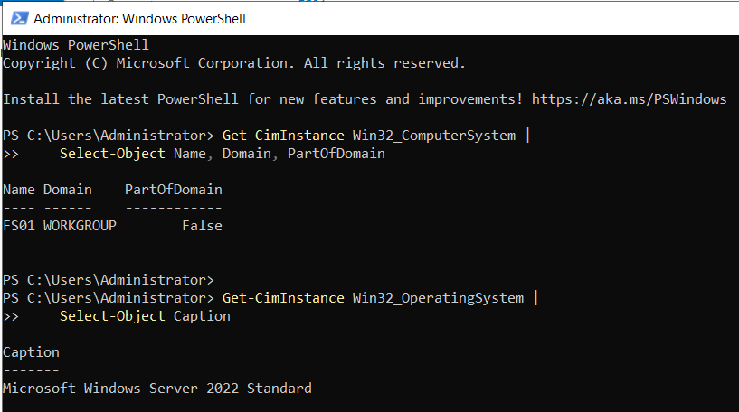

Initial output identifies FS01 in WORKGROUP with PartOfDomain=False, running Microsoft Windows Server 2022 Standard.

## E02/E03 — Domain enrollment

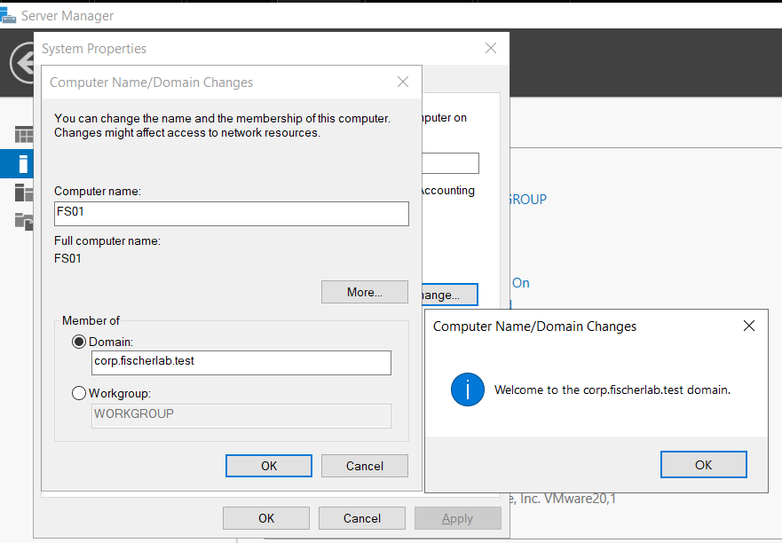

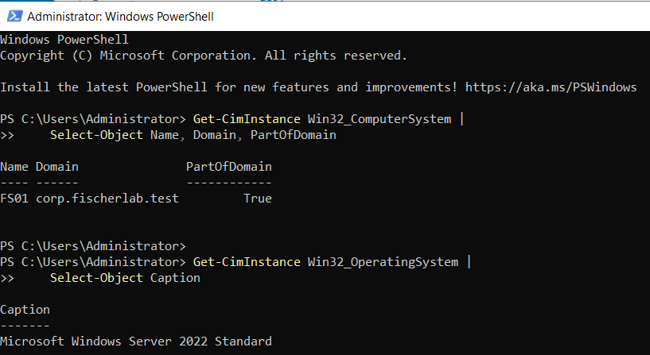

Welcome dialog confirms enrollment in corp.fischerlab.test. Subsequent identity output shows FS01, corp.fischerlab.test, PartOfDomain=True, and Windows Server 2022 Standard. Static IP and secure channel are not shown in these captures.

## E04 — Servers OU placement

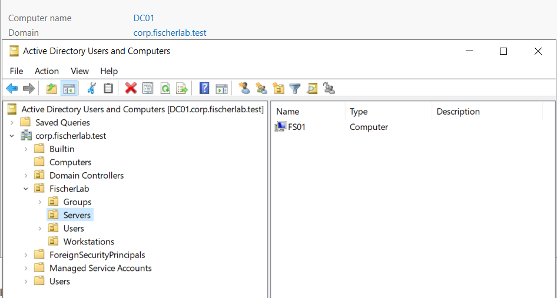

ADUC shows FS01 Computer object in FischerLab/Servers. Shares, file-access groups, permissions, and access tests are not yet demonstrated.
