# LAB-008 — Department drive mapping evidence

## E12 — Accounting reconnect corrected

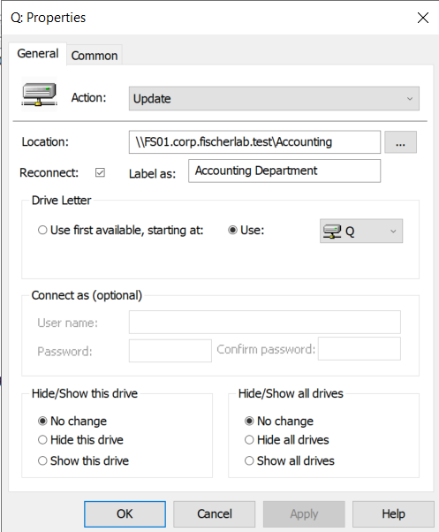

Q: mapping now shows Reconnect checked, retaining Update action, Accounting UNC path, fixed Q letter, and Accounting Department label. Apply is disabled. This verifies the configuration correction as displayed; persistence across a later workstation restart has not been separately tested. Use this capture as the current Accounting mapping configuration evidence; E07 preserves the earlier unchecked state.

## E04–E08 — Accounting onboarding and mapping settings

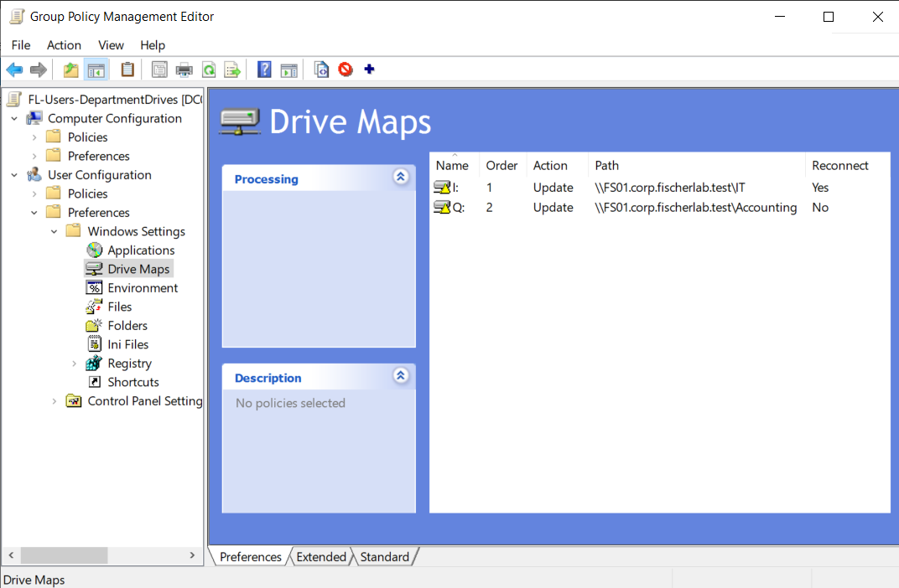

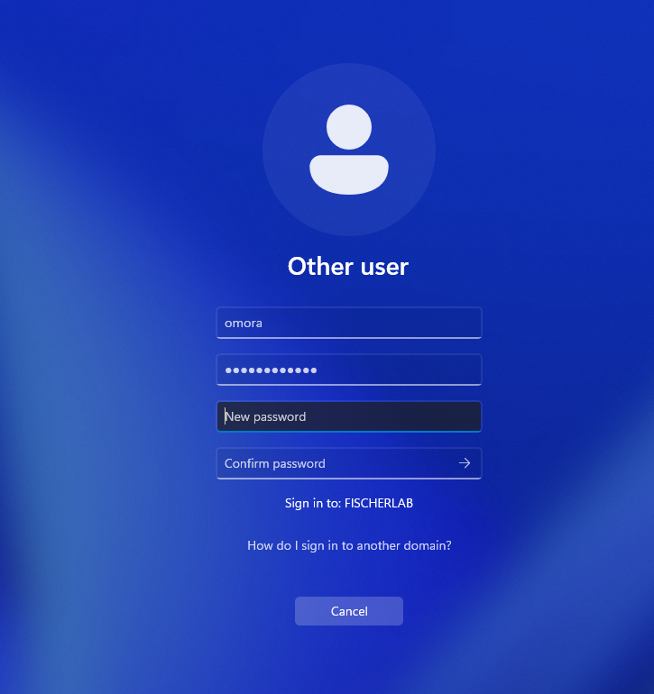

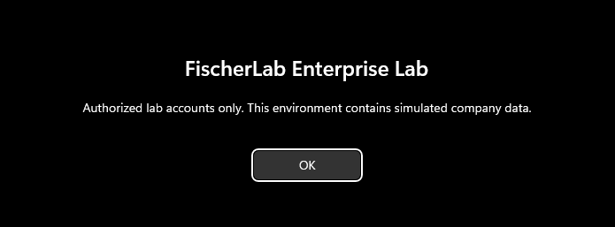

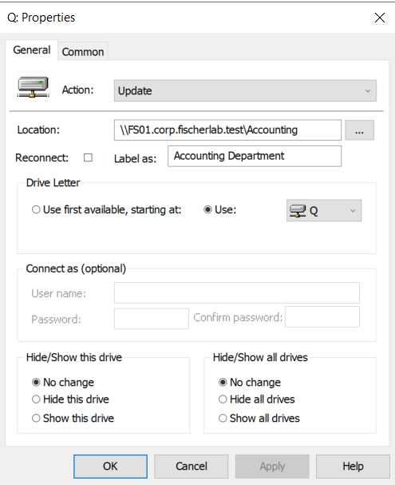

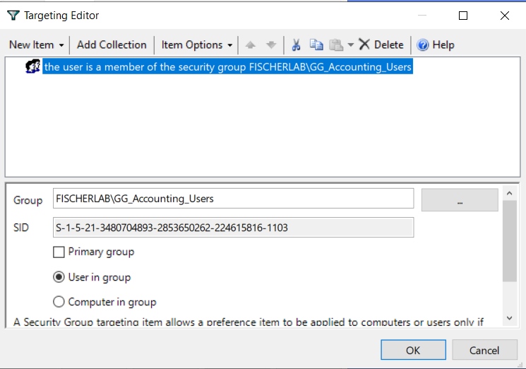

Mappings use Update with expected IT and Accounting UNC paths. Q: label is Accounting Department and targeting selects user in GG_Accounting_Users, with Primary group unchecked. Q: Reconnect is unchecked (list shows No); enable to match the intended persistence configuration. Password-change prompt for omora is visible with masked existing password and empty new-password fields. A subsequent successful session supports completion of onboarding, though password-change submission itself is not captured. Sign-in notice is also displayed.

## E09–E11 — Accounting policy, mapping, and authorization tests

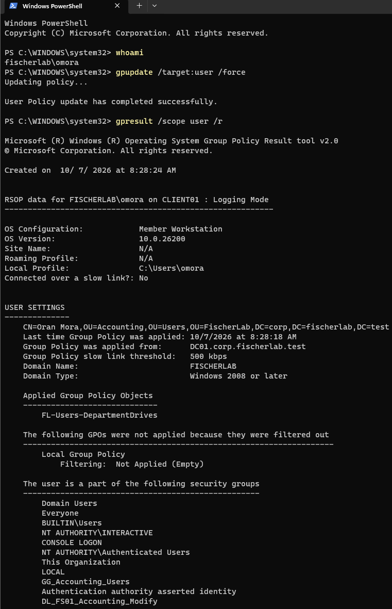

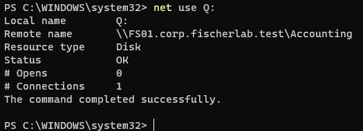

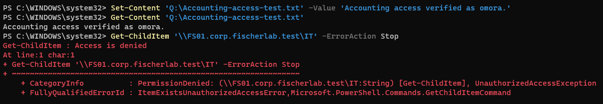

whoami confirms fischerlab\omora. User-policy update succeeds; gpresult identifies Oran Mora in FischerLab/Users/Accounting on CLIENT01 with FL-Users-DepartmentDrives applied from DC01. Membership includes GG_Accounting_Users and DL_FS01_Accounting_Modify, corroborating group nesting. net use Q: reports Status OK and expected Accounting share. Set-Content and Get-Content verify Accounting write/read; IT listing returns Access is denied / PermissionDenied / UnauthorizedAccessException. Together with prior amelia results, both departments have positive own-share and negative other-share evidence. No timed reconnect/cleanup test is established by these captures.

## E01 — IT employee targeting

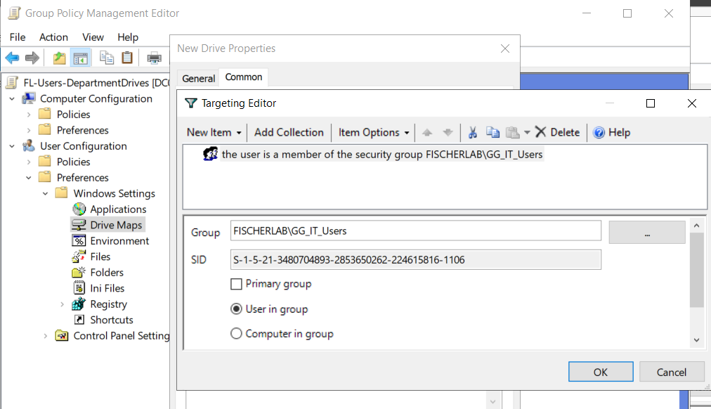

FL-Users-DepartmentDrives targeting editor shows user membership in FISCHERLAB\GG_IT_Users, with User in group selected and Primary group unchecked. This verifies the targeting condition as displayed.

## E02 — IT mapping configuration

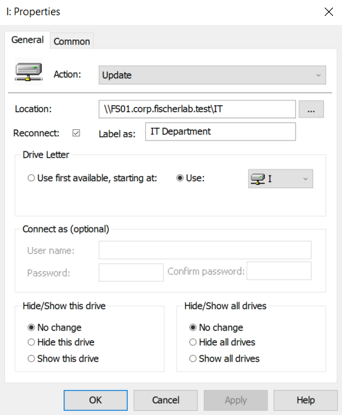

Update action, path \\FS01.corp.fischerlab.test\IT, Reconnect checked, label IT Department, and fixed drive letter I are configured. Alternate credentials are blank. GPO link and resulting user applied-policy list are not shown in this frame.

## E03 — Mapped-drive access

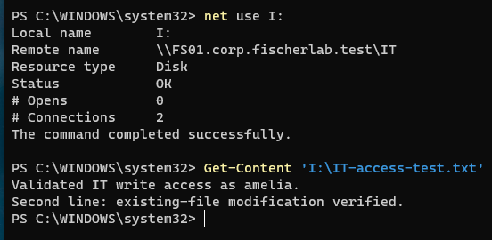

net use I: reports intended remote share and Status OK. Get-Content I:\IT-access-test.txt returns both validation lines. This verifies connected mapping and readback in the guided amelia workflow; identity and gpresult output are not in this particular frame. Collect gpresult with a subsequent department user test to corroborate user policy application.
