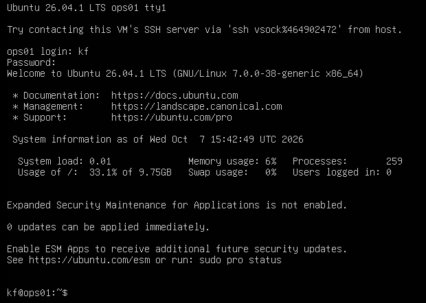
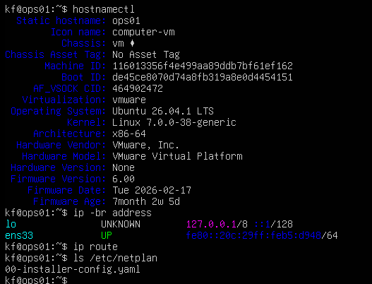

# LAB-009 — Ubuntu operations server evidence

## E01 — Guest console login

Guest displays Ubuntu 26.04.1 LTS, kernel 7.0.0-38-generic, hostname ops01, and successful console login as kf. Banner shows root filesystem approximately 9.75 GB with 33.1% used; virtual disk size and unallocated capacity are not established. No plaintext password is visible.

## E02 — Host and network preflight

hostnamectl confirms ops01, Ubuntu 26.04.1 LTS, x86-64, VMware virtualization. ens33 is UP with link-local IPv6 fe80::20c:29ff:feb5:d948/64 and no displayed IPv4 address. ip route returns no IPv4 routes. Netplan inventory shows 00-installer-config.yaml. This is a preconfiguration state, not failed static connectivity. YAML contents and renderer are not shown; inspect before editing.
# Additional network checkpoint

- `022-monitoring-firewall-after-reboot.png`: Timer/dashboard active, next trigger listed, UFW active with restricted SSH rule, loopback-only127.0.0.1:8080 listener, fresh healthy JSON and re-established SSH tunnel.
- `023-dashboard-after-reboot.png`: Dashboard after reboot, uptime2m, snapshot age28s and all six endpoint checks PASS; automatic collection and dashboard recovery verified.

- `019-dashboard-stale-snapshot.png`: Controlled collection pause; dashboard warns Snapshot stale at age187s. Endpoint PASS entries are retained historical results.
- `020-collector-pause-and-resume.png`: Commands stopping the timer and restarting timer/collector for the controlled exercise.
- `021-dashboard-recovered-snapshot.png`: Fresh snapshot after recovery, age30s, Checks passing and all six checks PASS.

- `017-live-health-dashboard.png`: CLIENT01 browser shows dashboard via localhost SSH tunnel, all six checks PASS, snapshot age46s, actual host metrics.
- `018-dashboard-service-and-ssh-tunnel.png`: Dashboard service enabled/active, initial immediate curl connection refused, and CLIENT01 SSH local-forward command. Later browser capture corroborates listener readiness; revised setup includes connection-refused retries. Bound-address verification and stale/reboot tests pending.

- `016-recurring-health-timer.png`: Timer enabled at startup; successful repeated snapshots at 16:48:54, 16:49:59 and 16:51:04 UTC; next trigger listed, latest JSON healthy. Verification warnings reference distribution XFS units' obsolete CPUAccounting option, not the collector units. Timer reboot persistence not yet exercised.

- `014-first-health-snapshot.png`: First collector output, healthy status, timestamp/host metrics and visible DNS/LDAP/SMB checks. Local SSH result is below the crop.
- `015-health-snapshot-scope.png`: End of JSON with scope stating DNS/TCP reachability only; no authenticated service checks.

- `013-runtime-time-service-preflight.png`: Python3.14.4, curl8.18.0, jq1.8.1; UTC timezone, synchronized clock, active NTP; no failed systemd units. Virtual-environment creation is not shown.

- `011-client01-dhcp-reservation.png`: DC01 OFFICE DHCP reservation for CLIENT01.corp.fischerlab.test at 10.10.20.100. MAC properties and subsequent lease renewal not shown.
- `012-office-restricted-ssh-rule.png`: Applied OFFICE IPv4 TCP pass rule, source 10.10.20.100 any port, destination 10.10.10.30 SSH22. Cropped screenshot does not establish complete OFFICE ruleset.

- `010-ufw-active-and-fresh-ssh-login.png`: UFW active and enabled at startup; default deny incoming/allow outgoing, low logging, SSH TCP22 allowed from 10.10.20.100 only. Separate fresh kf SSH session succeeds and reports ops01. No denied-source test shown.

- `009-reboot-persistence-storage-firewall.png`: Reboot and fresh SSH login successful; static IPv4/default route retained; SSH enabled/active. LVM VG has 8.22G free. UFW inactive; host firewall activation pending.

- `008-client01-authenticated-ssh-session.png`: Windows SSH client accepts/stores OPS01's ED25519 key and authenticates as kf. Remote whoami and hostname verify kf/ops01. Independent console fingerprint comparison and exact OFFICE rule are not captured; reboot persistence remains pending.

- `007-client01-ssh-tcp-connectivity.png`: CLIENT01/source 10.10.20.100 reaches OPS01 10.10.10.30 TCP22 successfully. User identifies the Windows session as omora; identity is not displayed. Firewall rule details and authenticated SSH login remain pending.

- `006-ssh-listener-and-phased-updates.png`: SSH enabled/running with IPv4 and IPv6 port22 listeners. apt upgrade deferred two named packages due to phasing; zero packages upgraded. Remote connectivity and authentication remain untested.

- `005-storage-ssh-package-preflight.png`: Root filesystem 9.8G with 6.3G available, virtual disk sda 20G, LVM partition sda3 18.2G and root LV 10G. OpenSSH service installed but inactive/disabled, with ssh.socket shown as trigger (socket status not captured). apt update successfully reaches configured Ubuntu repositories and reports two upgradeable packages. Actual upgrades and SSH listener verification remain pending.

- `004-static-network-and-dns-validation.png`: Netplan generated successfully and configuration accepted. ens33 has 10.10.10.30/24; default route uses 10.10.10.1; gateway responds with zero loss across three probes; internal DC01 and external example.com DNS queries succeed. SSH, package repository access, and reboot persistence remain untested.

- `003-existing-netplan-and-networkd.png`: Existing installer Netplan enables DHCP4 and DHCP6, matches MAC `00:0c:29:b5:d9:48`, and sets interface name `ens33`. Networkd manages the interface; only an IPv6 link-local address is present.
- User confirmed OPS01 was briefly attached to VMnet4, then moved it to the planned VMnet2 SERVERS network. VMware attachment is user-reported. Planned static address remains `10.10.10.30/24`, gateway `10.10.10.1`, DNS `10.10.10.10`; application and connectivity validation are pending.
